---
## Front matter
lang: ru-RU
title: Презентация по Лабораторной работе №1
subtitle: Операционные системы
author:
  Петрова Алевтина А. НКАбд-05-23
institute:
  - Российский университет дружбы народов, Москва, Россия
  
date: 01.03.2024

## i18n babel
babel-lang: russian
babel-otherlangs: english

## Formatting pdf
toc: false
toc-title: Содержание
slide_level: 2
aspectratio: 169
section-titles: true
theme: metropolis
header-includes:
 - \metroset{progressbar=frametitle,sectionpage=progressbar,numbering=fraction}
 - '\makeatletter'
 - '\beamer@ignorenonframefalse'
 - '\makeatother'
---

# Цель работы

Целью данной работы является приобретение практических навыков установки операционной системы на виртуальную машину, настройки минимально необходимых для дальнейшей работы сервисов.

# Задание

1. Создание виртуальной машины
2. Установка операционной системы
3. Работа с операционной системой после установки
4. Установка программного обеспечения для создания документации
5. Дополнительные задания

# Выполнение лабораторной работы

## Создание виртуальной машины

VirtualBox и Fedora я устанавливала и настраивала при выполнении лабораторных работ в курсе "Архитектура компьютера".

## Работа с операционной системой после установки

Запускаю виртуальную машину, вхожу в свою учетную запись

Открываю терминал и переключаюсь на роль пользователя с правами root 

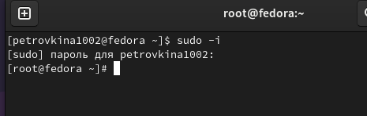

## Работа с операционной системой после установки

Обновляю все пакеты 

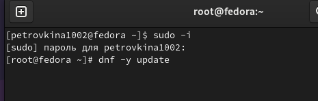 

## Работа с операционной системой после установки

Перемещаюсь в директорию /etc/selinux, открываю mc, ищу нужный файл 

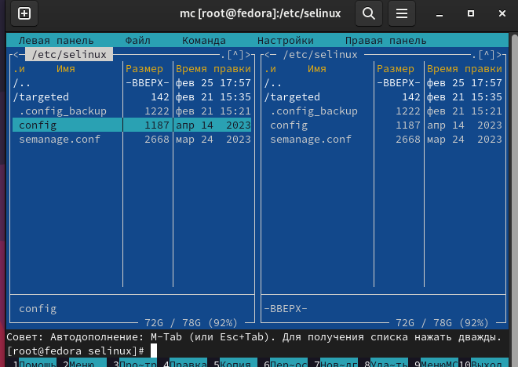 

## Работа с операционной системой после установки

Изменяю содержимое файла: SELINUX=enforcing меняю на SELINUX=permissive 

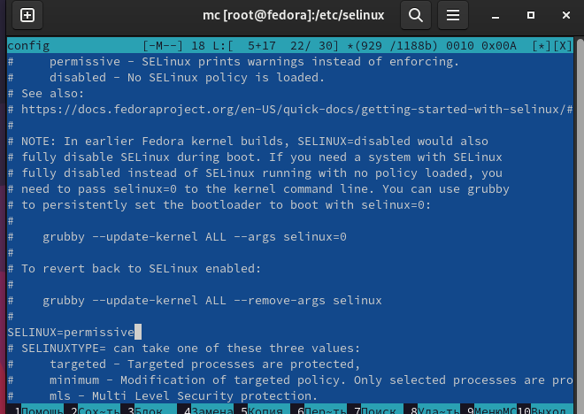

## Работа с операционной системой после установки

На следующим этапе выполнения лабораторной работы необходимо произвести установку необходимых драйверов для виртуальной машины. Так как виртуальная машина установлена на основную ОС Windows, этот пункт я пропустила, так как он необходим лишь в случае, если виртуальная машина установлена на ОС Linux.

Далее было необходимо настроить раскладку клавиатуры. Она была настроена мной при первоначальном запуске дистрибутива через графический интерфейс. Для демонстрации этого я открыла файл /etc/X11/xorg.conf.d/00-keyboard.conf .

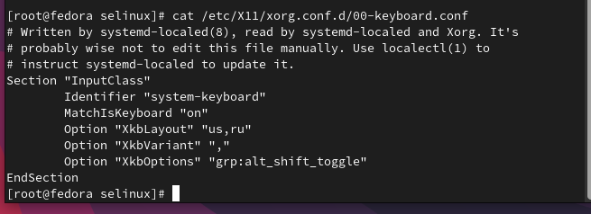

## Работа с операционной системой после установки

После этого необходимо было задать имя пользователя и хоста. 

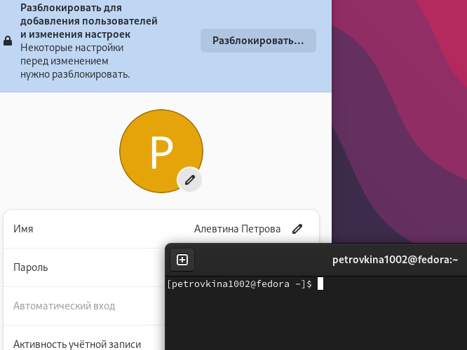

## Работа с операционной системой после установки

Вывод команды dmesg | less 

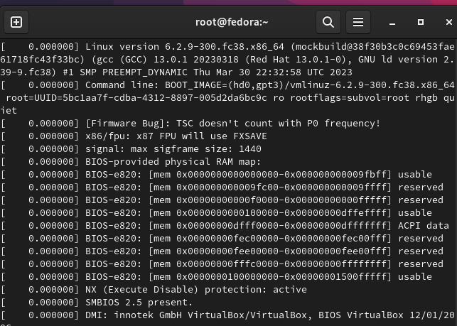

## Установка программного обеспечения для создания документации

Все необходимые утилиты, такие как Pandoc, Pandoc-crossref и TexLive, были установлены еще в предыдущем семестре.

## Выполнение домашней работы 
Дожидаюсь загрузки графического окружения и открываю терминал. Далее в терминале анализирую по
последовательность загрузки системы, выполнив команду dmesg.

Далее получаю следующую информацию о версии ядра

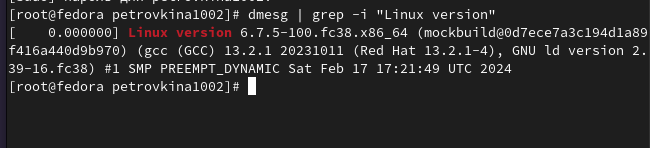

## Выполнение домашней работы

 Частота процессора

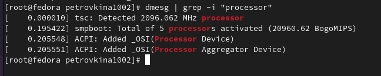

## Выполнение домашней работы

Модель процессора 
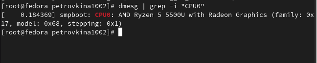

## Выполнение домашней работы
Объём доступной памяти 
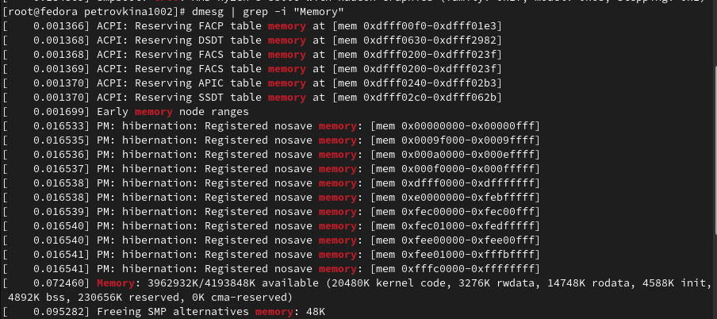

## Выполнение домашней работы

Тип обнаруженного гипервизора 
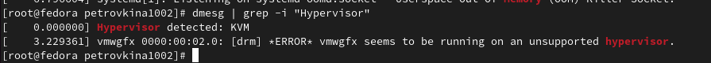

## Выполнение домашней работы

Данные о типе файловой системы корневого потока 

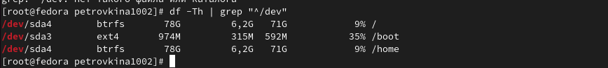

## Выполнение домашней работы

Последовательность монтирования файловых систем 

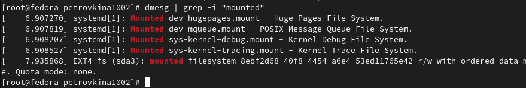

## Выводы

При выполнении данной лабораторной работы я приобрела практические навыки установки операционной системы на виртуальную машину, а так же сделала настройки минимально необходимых для дальнейшей работы сервисов.

## Список литературы

::: {#refs}
1. Dash P. Getting started with oracle vm virtualbox. Packt Publishing Ltd, 2013. 86 p.
2. Colvin H. Virtualbox: An ultimate guide book on virtualization with virtualbox. CreateSpace Independent Publishing Platform, 2015. 70 p.
3. van Vugt S. Red hat rhcsa/rhce 7 cert guide : Red hat enterprise linux 7 (ex200 and ex300). Pearson IT Certification, 2016. 1008 p.
4. Робачевский А., Немнюгин С., Стесик О. Операционная система unix. 2-е изд. Санкт-Петербург: БХВ-Петербург, 2010. 656 p.
5. Немет Э. et al. Unix и Linux: руководство системного администратора. 4-е изд. Вильямс, 2014. 1312 p.
6. Колисниченко Д.Н. Самоучитель системного администратора Linux. СПб.: БХВ-Петербург, 2011. 544 p.
7. Robbins A. Bash pocket reference. O’Reilly Media, 2016. 156 p.

:::

