---
## Front matter
title: "Отчет по лабораторной работе №1"
subtitle: "Операционные системы"
author: "Петрова Алевтина Александровна"

## Generic otions
lang: ru-RU
toc-title: "Содержание"

## Bibliography
bibliography: bib/cite.bib
csl: pandoc/csl/gost-r-7-0-5-2008-numeric.csl

## Pdf output format
toc: true # Table of contents
toc-depth: 2
lof: true # List of figures
lot: true # List of tables
fontsize: 12pt
linestretch: 1.5
papersize: a4
documentclass: scrreprt
## I18n polyglossia
polyglossia-lang:
  name: russian
  options:
	- spelling=modern
	- babelshorthands=true
polyglossia-otherlangs:
  name: english
## I18n babel
babel-lang: russian
babel-otherlangs: english
## Fonts
mainfont: PT Serif
romanfont: PT Serif
sansfont: PT Sans
monofont: PT Mono
mainfontoptions: Ligatures=TeX
romanfontoptions: Ligatures=TeX
sansfontoptions: Ligatures=TeX,Scale=MatchLowercase
monofontoptions: Scale=MatchLowercase,Scale=0.9
## Biblatex
biblatex: true
biblio-style: "gost-numeric"
biblatexoptions:
  - parentracker=true
  - backend=biber
  - hyperref=auto
  - language=auto
  - autolang=other*
  - citestyle=gost-numeric
## Pandoc-crossref LaTeX customization
figureTitle: "Рис."
tableTitle: "Таблица"
listingTitle: "Листинг"
lofTitle: "Список иллюстраций"
lotTitle: "Список таблиц"
lolTitle: "Листинги"
## Misc options
indent: true
header-includes:
  - \usepackage{indentfirst}
  - \usepackage{float} # keep figures where there are in the text
  - \floatplacement{figure}{H} # keep figures where there are in the text
---

# Цель работы

Целью данной работы является приобретение практических навыков установки операционной системы на виртуальную машину, настройки минимально необходимых для дальнейшей работы сервисов.

# Задание

1. Создание виртуальной машины
2. Установка операционной системы
3. Работа с операционной системой после установки
4. Установка программного обеспечения для создания документации
5. Дополнительные задания

# Выполнение лабораторной работы

## Создание виртуальной машины

VirtualBox и Fedora я устанавливала и настраивала при выполнении лабораторных работ в курсе "Архитектура компьютера".

## Работа с операционной системой после установки

Запускаю виртуальную машину, вхожу в свою учетную запись

Открываю терминал и переключаюсь на роль пользователя с правами root (рис. 3.1).

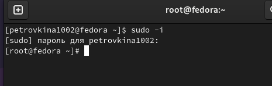{ #fig:001 width=70% }

Обновляю все пакеты (рис. 3.2).

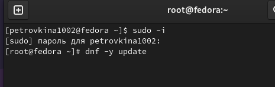 { #fig:002 width=70% }

Перемещаюсь в директорию /etc/selinux, открываю mc, ищу нужный файл (рис. 3.3).

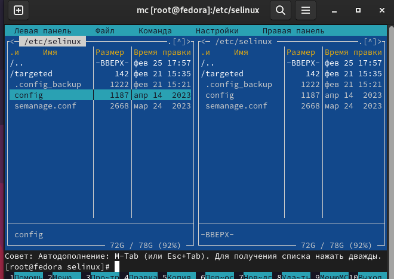 { #fig:003 width=70% }

Изменяю содержимое файла: SELINUX=enforcing меняю на SELINUX=permissive (рис. 3.4).

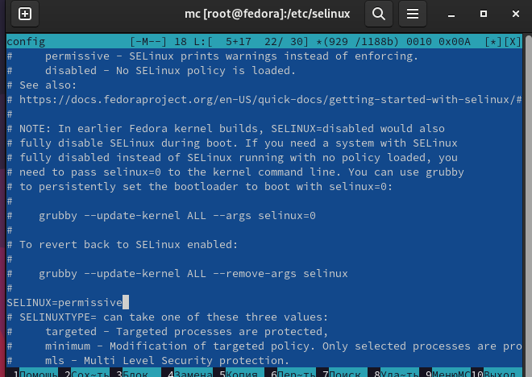{ #fig:004 width=70% }

На следующим этапе выполнения лабораторной работы необходимо произвести установку необходимых драйверов для виртуальной машины. Так как виртуальная машина установлена на основную ОС Windows, этот пункт я пропустила, так как он необходим лишь в случае, если виртуальная машина установлена на ОС Linux.

Далее было необходимо настроить раскладку клавиатуры. Она была настроена мной при первоначальном запуске дистрибутива через графический интерфейс. Для демонстрации этого я открыла файл /etc/X11/xorg.conf.d/00-keyboard.conf (рис.3.5).

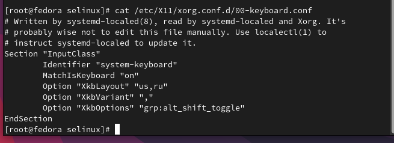{ #fig:005 width=70% }

После этого необходимо было задать имя пользователя и хоста. Это также было сделано мной
ранее при первоначальной настройке дистрибутива (рис.3.6).

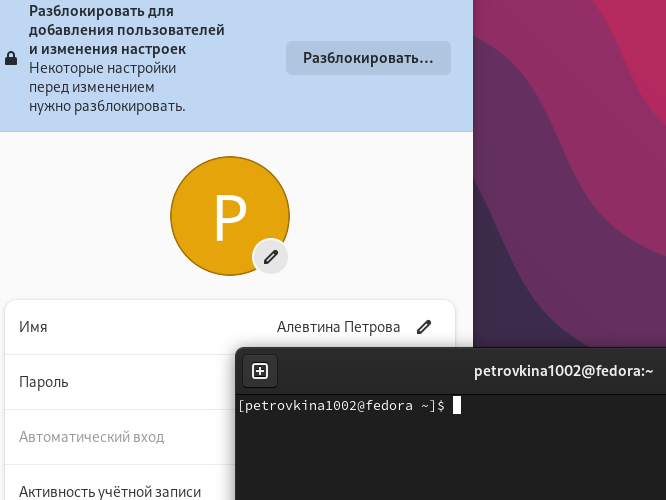{ #fig:006 width=70% }

Затем я произвела вывод команды dmesg | less (рис.3.7).

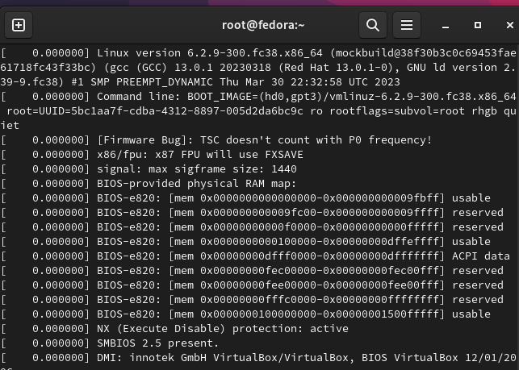{ #fig:007 width=70% }

## Установка программного обеспечения для создания документации

Все необходимые утилиты, такие как Pandoc, Pandoc-crossref и TexLive, были установлены еще в предыдущем семестре.

## Выполнение домашней работы 
Дожидаюсь загрузки графического окружения и открываю терминал. Далее в терминале анализирую по
последовательность загрузки системы, выполнив команду dmesg.

Далее получаю следующую информацию о версии ядра(Рис 8)

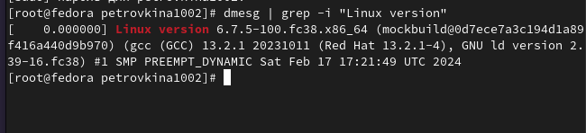{#fig:008 width=100%}
Затем таким же образом нахожу частоту процессора(Рис 9)

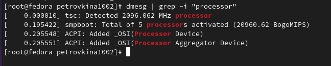{#fig:009 width=70%}
Затем получаю данные о модели процессора (рис 10)
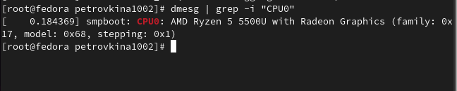{#fig:010 width=100%}
Далее смотрю объём доступной памяти (рис 11)
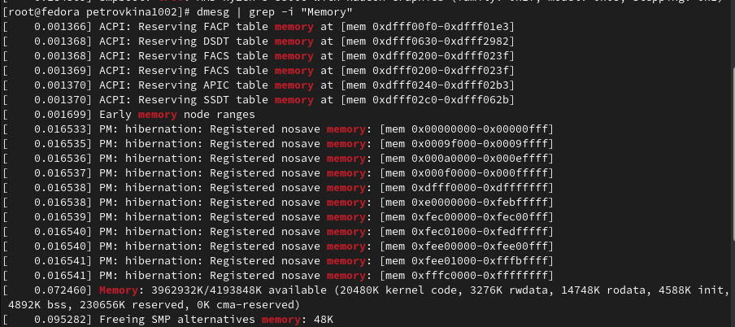{#fig:011 width=100%} 
Получаю данные о типе обнаруженного гипервизора (рис 12)
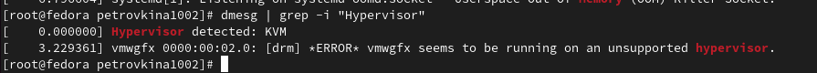{#fig:012 width=100%}
Данные о типе файловой системы корневого потока мне не удалось получить с помощью dmesg | grep -i
как в остальных случаях. Поэтому я использовала другую команду (Рис 13)

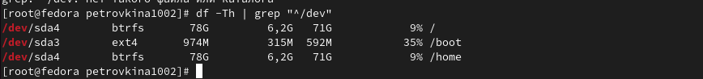{#fig:013 width=100%}

И в конце ищу последовательность монтирования файловых систем (Рис 14)

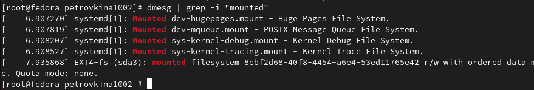{#fig:014 width=100%}

# Выводы

При выполнении данной лабораторной работы я приобрела практические навыки установки операционной системы на виртуальную машину, а так же сделала настройки минимально необходимых для дальнейшей работы сервисов.

# Ответы на контрольные вопросы

1. Учетная запись содержит необходимые для идентификации пользователя при подключении к системе данные, а так же информацию для авторизации и учета: системного имени (user name) (оно может содержать только латинские буквы и знак нижнее подчеркивание, еще оно должно быть уникальным), идентификатор пользователя (UID) (уникальный идентификатор пользователя в системе, целое положительное число), идентификатор группы (CID) (группа, к к-рой относится пользователь. Она, как минимум, одна, по умолчанию - одна), полное имя (full name) (Могут быть ФИО), домашний каталог (home directory) (каталог, в к-рый попадает пользователь после входа в систему и в к-ром хранятся его данные), начальная оболочка (login shell) (командная оболочка, к-рая запускается при входе в систему).

2. Для получения справки по команде: <команда> --help; для перемещения по файловой системе - cd; для просмотра содержимого каталога - ls; для определения объёма каталога - du <имя каталога>; для создания / удаления каталогов - mkdir/rmdir; для создания / удаления файлов - touch/rm; для задания определённых прав на файл / каталог - chmod; для просмотра истории команд - history

3. Файловая система - это порядок, определяющий способ организации и хранения и именования данных на различных носителях информации. Примеры: FAT32 представляет собой пространство, разделенное на три части: олна область для служебных структур, форма указателей в виде таблиц и зона для хранения самих файлов. ext3/ext4 - журналируемая файловая система, используемая в основном в ОС с ядром Linux.

4. С помощью команды df, введя ее в терминале. Это утилита, которая показывает список всех файловых систем по именам устройств, сообщает их размер и данные о памяти. Также посмотреть подмонтированные файловые системы можно с помощью утилиты mount.

5. Чтобы удалить зависший процесс, вначале мы должны узнать, какой у него id: используем команду ps. Далее в терминале вводим команду kill < id процесса >. Или можно использовать утилиту killall, что "убьет" все процессы, которые есть в данный момент, для этого не нужно знать id процесса.

# Список литературы{.unnumbered}

::: {#refs}
1. Dash P. Getting started with oracle vm virtualbox. Packt Publishing Ltd, 2013. 86 p.
2. Colvin H. Virtualbox: An ultimate guide book on virtualization with virtualbox. CreateSpace Independent Publishing Platform, 2015. 70 p.
3. van Vugt S. Red hat rhcsa/rhce 7 cert guide : Red hat enterprise linux 7 (ex200 and ex300). Pearson IT Certification, 2016. 1008 p.
4. Робачевский А., Немнюгин С., Стесик О. Операционная система unix. 2-е изд. Санкт-Петербург: БХВ-Петербург, 2010. 656 p.
5. Немет Э. et al. Unix и Linux: руководство системного администратора. 4-е изд. Вильямс, 2014. 1312 p.
6. Колисниченко Д.Н. Самоучитель системного администратора Linux. СПб.: БХВ-Петербург, 2011. 544 p.
7. Robbins A. Bash pocket reference. O’Reilly Media, 2016. 156 p.

:::

