---
## Front matter
lang: ru-RU
title: Лабораторная работа №2
subtitle: Операционные системы
author:
  Петрова А.А. НКАбд-05-23
institute:
  - Российский университет дружбы народов, Москва, Россия
  
date: 02 марта 2024

## i18n babel
babel-lang: russian
babel-otherlangs: english

## Formatting pdf
toc: false
toc-title: Содержание
slide_level: 2
aspectratio: 169
section-titles: true
theme: metropolis
header-includes:
 - \metroset{progressbar=frametitle,sectionpage=progressbar,numbering=fraction}
 - '\makeatletter'
 - '\beamer@ignorenonframefalse'
 - '\makeatother'
---
## Цель работы

Цель данной лабораторной работы -- изучение идеологии и применения средств контроля версий, освоение умения по работе с git.

## Задание

1. Создать базовую конфигурацию для работы с git
2. Создать ключ SSH
3. Создать ключ GPG
4. Настроить подписи Git
5. Заргеистрироваться на GitHub
6. Создать локальный каталог для выполнения заданий по предмету.

# Выполнение лабораторной работы

## Установка программного обеспечения

Устанавливаю необходимое программное обеспечение git и gh 
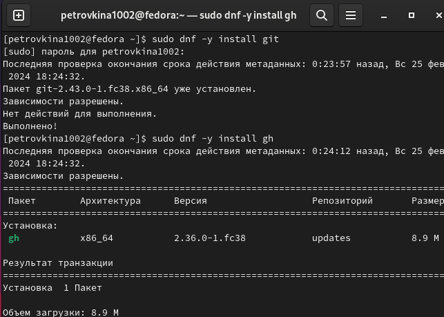{width=40%}

## Базовая настройка git

Задаю в качестве имени и email владельца репозитория свои имя, фамилию и электронную почту 

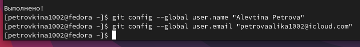

## Базовая настройка git

Настраиваю utf-8 в выводе сообщений git для их корректного отображения 

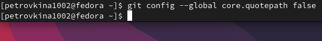

## Базовая настройка git

Начальной ветке задаю имя master 

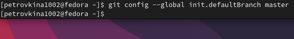

## Базовая настройка git

Задаю параметры autocrlf и safecrlf для корректного отображения конца строки 

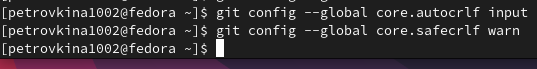

## Создание ключа SSH

Создаю ключ ssh размером 4096 бит по алгоритму rsa 

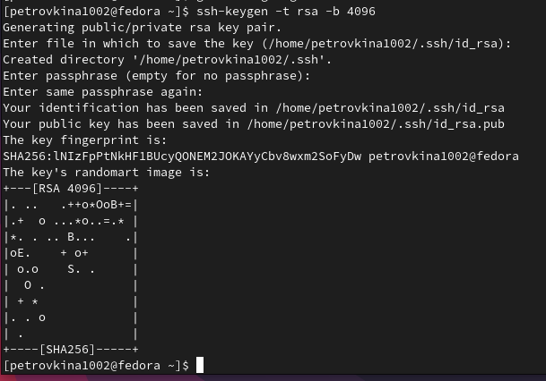{width=40%}

## Создание ключа SSH

Создаю ключ ssh по алгоритму ed25519 

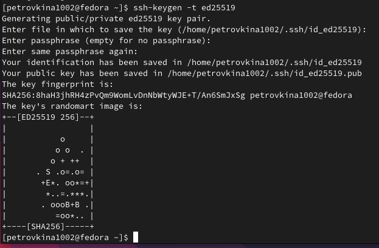{width=40%}

## Создание ключа GPG

Генерирую ключ GPG, затем выбираю тип ключа RSA and RSA, задаю максиммальную длину ключа: 4096, оставляю неограниченный срок действия ключа. Далее отвечаю на вопросы программы о личной информации 

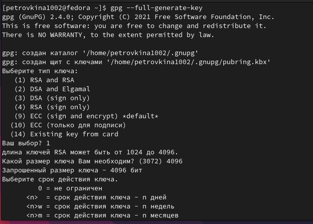{width=40%}

## Создание ключа GPG

Ввожу фразу-пароль для защиты нового ключа 

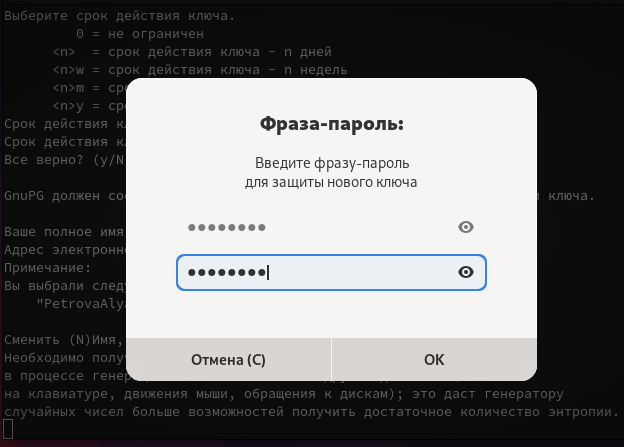{width=40%}

## Регистрация на Github

Мой аккаунт в GitHub 

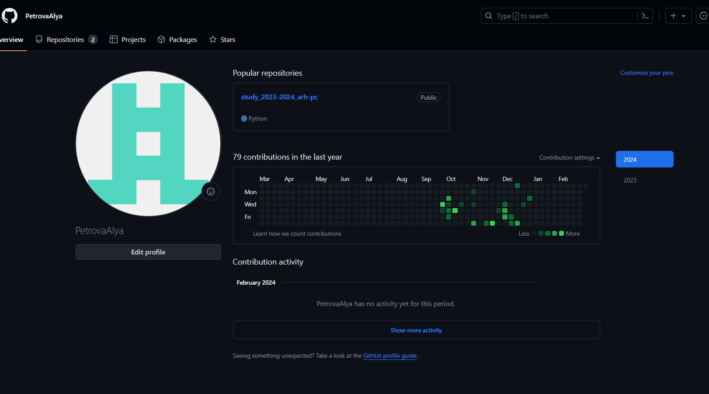

## Добавление ключа GPG в Github

- Вывожу список созданных ключей в терминал
- Ищу в результате запроса отпечаток ключа
- Копирую его в буфер обмена

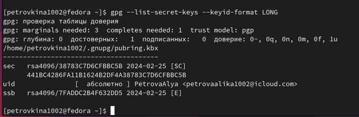

## Добавление ключа GPG в Github

Ввожу в терминале команду, с помощью которой копирую сам ключ GPG в буфер обмена, за это отвечает утилита xclip 

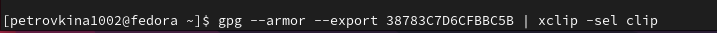

## Добавление ключа GPG в Github

Открываю настройки GitHub, ищу среди них добавление GPG ключа 

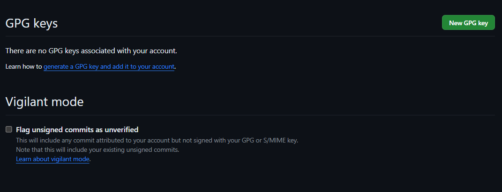

## Добавление ключа GPG в Github

Нажимаю на "New GPG key" и вставляю в поле ключ из буфера обмена

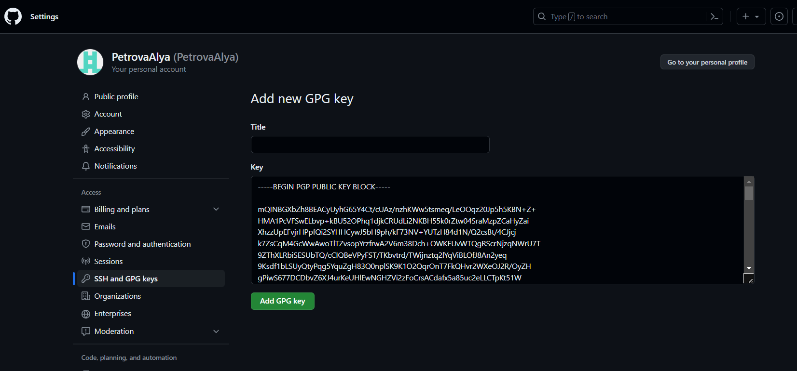

## Добавление ключа GPG в Github

Я добавила ключ GPG на GitHub 

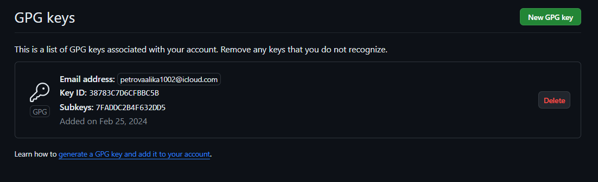

## Настроить подписи Git

Настраиваю автоматические подписи коммитов git

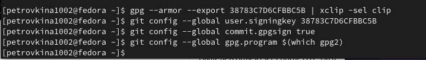

## Настройка gh

Начинаю авторизацию в gh, отвечаю на наводящие вопросы от утилиты, в конце выбираю авторизоваться через браузер 
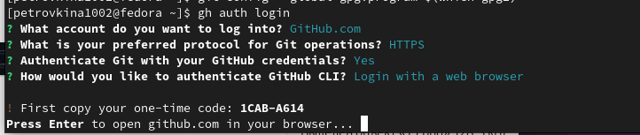

## Настройка gh

Завершаю авторизацию на сайте 

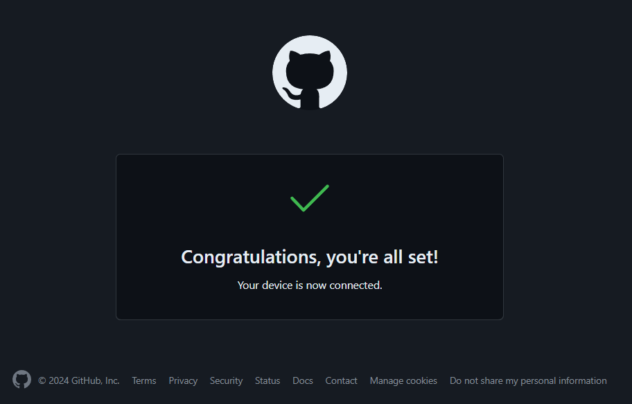

## Настройка gh

Вижу сообщение о завершении авторизации под именем PetrovaAlya 

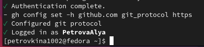

## Создание репозитория курса на основе шаблона

- Создаю директорию с помощью утилиты mkdir
- Перехожу в только что созданную директорию "Операционные системы".
- В терминале ввожу команду gh repo create study_2023-2024_os-intro --template yamadharma/course-directory-student-trmplate --public.
- После этого клонирую репозиторий к себе в директорию 

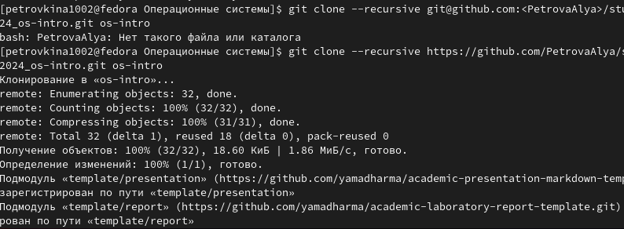

## Создание репозитория курса на основе шаблона

-Перехожу в каталог курса 
-проверяю содержание каталога 

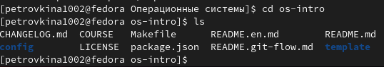

## Создание репозитория курса на основе шаблона

-Удаляю лишние файлы 
-Cоздаю необходимые каталоги 

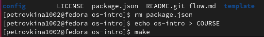

## Создание репозитория курса на основе шаблона

Добавляю все новые файлы для отправки на сервер  с помощью команды git add 
Комментирую их с помощью git commit 

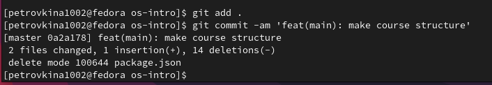

## Создание репозитория курса на основе шаблона

Отправляю файлы на сервер с помощью git push 

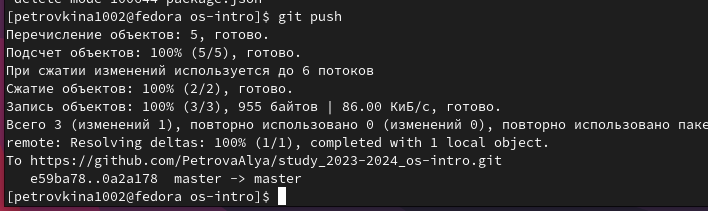

## Выводы

При выполнении данной лабораторной работы я изучила идеологию и применение средств контроля версий, освоила умение по работе с git.

## Список литературы

::: {#refs}
1. Лабораторная работа № 2 [Электронный ресурс] URL: https://esystem.rudn.ru/mod/page/view.php?id=970819
:::

#Спасибо за внимание

