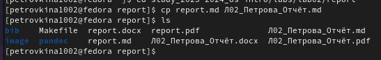
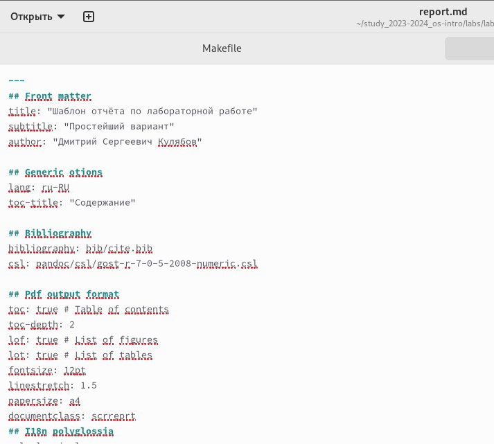
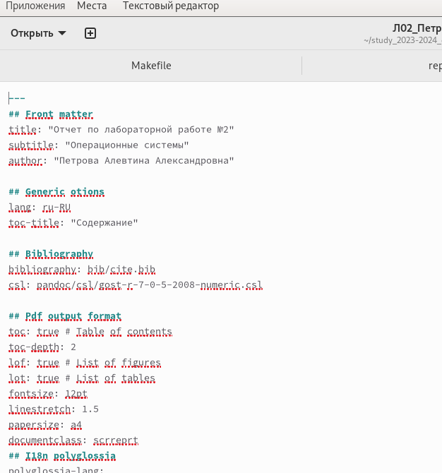
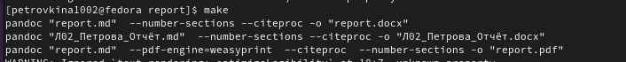
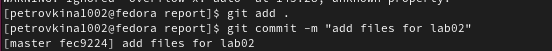

---
## Front matter
lang: ru-RU
title: Презентация Лабораторной работы №3
subtitle: Операционные системы
author:
  - Петрова А.А. НКАбд-05-23
institute:
  - Российский университет дружбы народов, Москва, Россия
  
date: 02 марта 2024

## i18n babel
babel-lang: russian
babel-otherlangs: english

## Formatting pdf
toc: false
toc-title: Содержание
slide_level: 2
aspectratio: 169
section-titles: true
theme: metropolis
header-includes:
 - \metroset{progressbar=frametitle,sectionpage=progressbar,numbering=fraction}
 - '\makeatletter'
 - '\beamer@ignorenonframefalse'
 - '\makeatother'
---

## Цель работы

Научиться оформлять отчёты с помощью легковесного языка разметки Markdown

## Задание

1. Сделать отчёт по предыдущей Лабораторной работе в формате Markdown 
2. В качестве отчётов предоставляются файлы в трёх форматах:pdf, docx и md

## Теоретическое введение

Markdown- облегченный язык разметки, созданный с целью обозначения форматирования в простом тексте, с максимальным сохранением читаемости его человеком.

## Выполнение лабораторной работы

Перехожу в каталог, в котором находится шаблон для отчёта по лабораторной работе 

## Выполнение лабораторной работы

Создаю копию шаблона, в которой буду работать 

## Выполнение лабораторной работы

Открываю созданный файл 

{width=40%}

## Выполнение лабораторной работы

копирую шаблон и вставляю в редактор 

{width=40%}

## Выполнение лабораторной работы

После изменения шаблона в соответствии с языком разметки Markdown, я выполнила его компиляцию 

## Выполнение лабораторной работы

Далее я отправила созданные файлы в глобальный репозиторий 

## Выполнение лабораторной работы

## Выводы

В ходе лабораторной работы я научилась оформлять отчёты с помощью языка разметки Markdown

## Список литературы

::: {#refs}
https://esystem.rudn.ru/pluginfile.php/2288079/mod_resource/content/3/003-lab_markdown.pdf
:::

