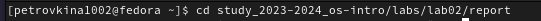
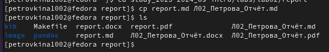
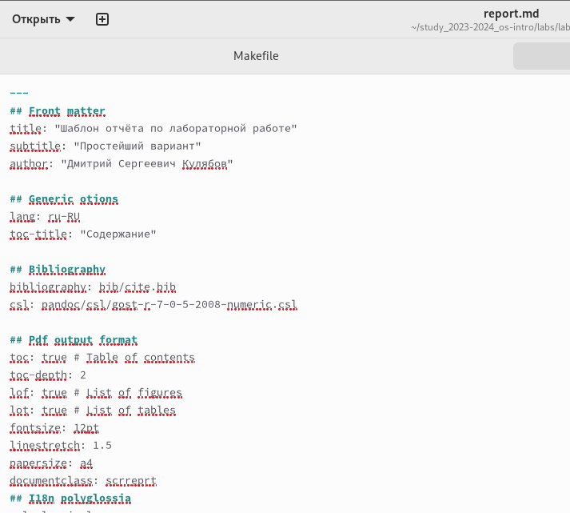
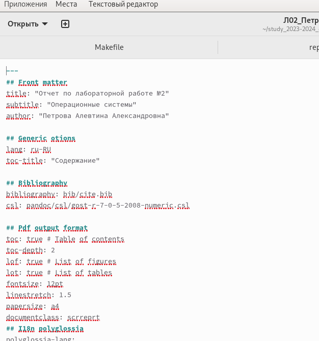
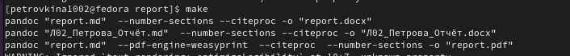
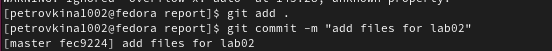
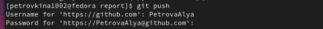

---
## Front matter
title: "Отчёт по Лабораторной работе №3"
subtitle: "Операционные системы"
author: "Петрова А.А."

## Generic otions
lang: ru-RU
toc-title: "Содержание"

## Bibliography
bibliography: bib/cite.bib
csl: pandoc/csl/gost-r-7-0-5-2008-numeric.csl

## Pdf output format
toc: true # Table of contents
toc-depth: 2
lof: true # List of figures
lot: true # List of tables
fontsize: 12pt
linestretch: 1.5
papersize: a4
documentclass: scrreprt
## I18n polyglossia
polyglossia-lang:
  name: russian
  options:
	- spelling=modern
	- babelshorthands=true
polyglossia-otherlangs:
  name: english
## I18n babel
babel-lang: russian
babel-otherlangs: english
## Fonts
mainfont: PT Serif
romanfont: PT Serif
sansfont: PT Sans
monofont: PT Mono
mainfontoptions: Ligatures=TeX
romanfontoptions: Ligatures=TeX
sansfontoptions: Ligatures=TeX,Scale=MatchLowercase
monofontoptions: Scale=MatchLowercase,Scale=0.9
## Biblatex
biblatex: true
biblio-style: "gost-numeric"
biblatexoptions:
  - parentracker=true
  - backend=biber
  - hyperref=auto
  - language=auto
  - autolang=other*
  - citestyle=gost-numeric
## Pandoc-crossref LaTeX customization
figureTitle: "Рис."
tableTitle: "Таблица"
listingTitle: "Листинг"
lofTitle: "Список иллюстраций"
lotTitle: "Список таблиц"
lolTitle: "Листинги"
## Misc options
indent: true
header-includes:
  - \usepackage{indentfirst}
  - \usepackage{float} # keep figures where there are in the text
  - \floatplacement{figure}{H} # keep figures where there are in the text
---

# Цель работы

Научиться оформлять отчёты с помощью легковесного языка разметки Markdown

# Задание

1. Сделать отчёт по предыдущей Лабораторной работе в формате Markdown 
2. В качестве отчётов предоставляются файлы в трёх форматах:pdf, docx и md

# Теоретическое введение

Markdown- облегченный язык разметки, созданный с целью обозначения форматирования в простом тексте, с максимальным сохранением читаемости его человеком.

# Выполнение лабораторной работы

перехожу в каталог, в котором находится шаблон для отчёта по лабораторной работе с помощью утилиты cd (рис. 1)

{#fig:001 width=70%}

Создаю копию шаблона, в которой буду работать, с помощью утилиты cp (рис.2)

{#fig:002 width=70%}

Открываю созданный файл (рис.3) 

{#fig:003 width=70%}

копирую шаблон и вставляю в редактор 

Затем я пишу отчёт в редакторе (для удобства), а после уже готовы отчёт вставляю в ранее созданный файл md (рис. 4)

{#fig:004 width=70%}

После изменения шаблона в соотсветствии с языком разметки Markdown, я выполнила его компиляцию 

{#fig:005 width=70%}

Далее я отправила созданные файлы в глобальный репозиторий (рис.6)

{#fig:006 width=70%}

И в конце осуществила последние действие в отправке с помощью команды git push (рис. 7)
{#fig:007 width=70%}

# Выводы

В ходе лабораторной работы я научилась оформлять отчёты с помощью языка разметки Markdown

# Список литературы{.unnumbered}

::: {#refs}
https://esystem.rudn.ru/pluginfile.php/2288079/mod_resource/content/3/003-lab_markdown.pdf
:::
