---
## Front matter
lang: ru-RU
title: Презентация Лабороторной работы №4
subtitle: Операционные системы
author:
  - Петрова А.А. НКАбд-05-23
institute:
  - Российский университет дружбы народов, Москва, Россия
  
date: 08 марта  2024

## i18n babel
babel-lang: russian
babel-otherlangs: english

## Formatting pdf
toc: false
toc-title: Содержание
slide_level: 2
aspectratio: 169
section-titles: true
theme: metropolis
header-includes:
 - \metroset{progressbar=frametitle,sectionpage=progressbar,numbering=fraction}
 - '\makeatletter'
 - '\beamer@ignorenonframefalse'
 - '\makeatother'
---

## Цель работы

Получение навыков правильной работы с репозиториями git.

## Задание
Выполнить работу для тестового репозитория. 
Преобразовать рабочий репозиторий в репозиторий с git-flow и conventional commits.

## Теоретическое введение

Gitflow Workflow опубликована и популяризована Винсентом Дриссеном. 
Gitflow Workflow предполагает выстраивание строгой модели ветвления с учётом выпуска проекта.
 Данная модель отлично подходит для организации рабочего процесса на основе релизов. 
 Работа по модели Gitflow включает создание отдельной ветки для исправлений ошибок в рабочей среде. 
 Последовательность действий при работе по модели Gitflow: Из ветки master создаётся ветка develop. 
 	Из ветки develop создаётся ветка release. 
	Из ветки develop создаются ветки feature. 
	Когда работа над веткой feature завершена, она сливается с веткой develop. 
	Когда работа над веткой релиза release завершена, она сливается в ветки develop и master. 
	Если в master обнаружена проблема, из master создаётся ветка hotfix. 
	Когда работа над веткой исправления hotfix завершена, она сливается в ветки develop и master.

## Выполнение лабораторной работы

Устанавливаю gitflow (рис.1).

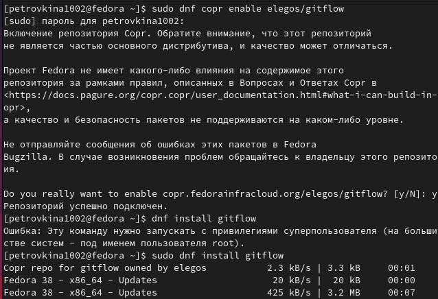{width=40%}

## Выполнение лабораторной работы

Устанавливаю gitflow (рис.2).

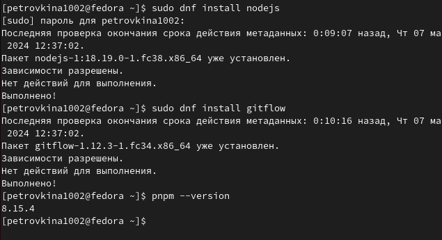{width=40%}

## Выполнение лабораторной работы

Для работы с NODE.JS добавим каталог с исполняемыми файлами. Запускаю, используя команду pnpm setup (рис.3).

{width=70%}

## Выполнение лабораторной работы

Выполняю команду source ~/.bash.rc. Добавляю программу,которая используется для помощи в форматировании коммитов  (рис.4).

{width=70%}

## Выполнение лабораторной работы

Добавляю программу, для помощи в созданиии логов (рис.5).

{width=70%}

## Выполнение лабораторной работы

Создаю пустой файл в новый репозиторий, делаю первый коммит и выкладываю на github (рис.6).

{width=40%}

## Выполнение лабораторной работы

Проверяю изменения (рис.7).

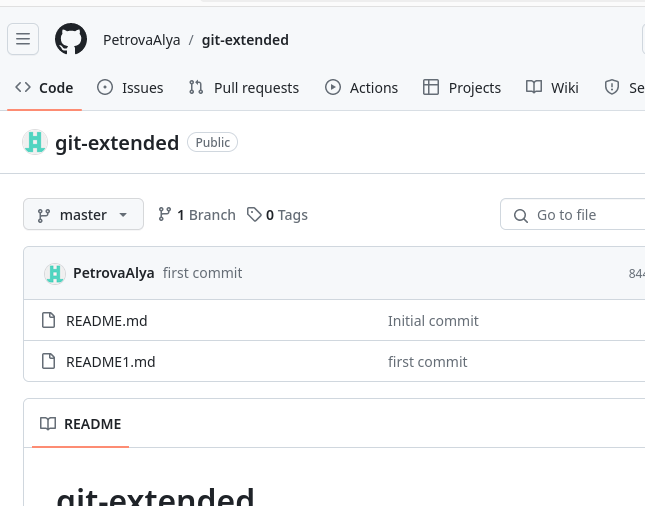{width=40%}

## Выполнение лабораторной работы

Выполняю конфигурацию для пакетов NODE.js (рис.8).

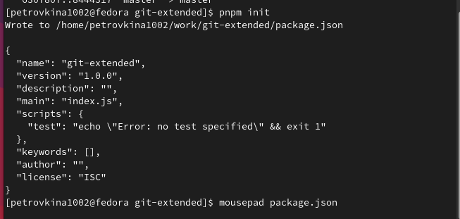{width=50%}

## Выполнение лабораторной работы

Изменяю файл package.json (рис.9).

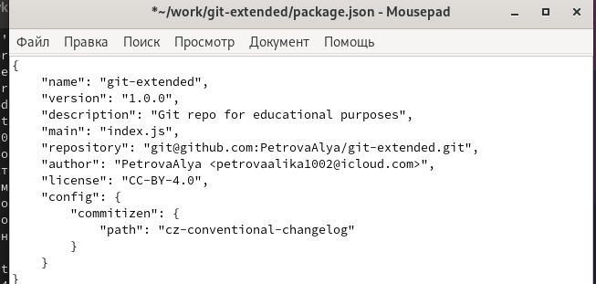{width=70%}

## Выполнение лабораторной работы

Добавляю новый файлы,выполняю коммит и отправляю изменения на github (рис.10).

{width=40%}

## Выполнение лабораторной работы

Инициализирую gitflow, префикс для ярлыков устанавливаю в v (рис.11).

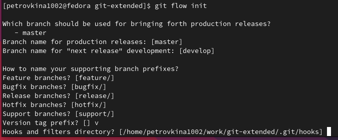{width=70%}

## Выполнение лабораторной работы

Проверяю,что нахожусь на ветке develop и отправляю весь репозиторий в хранилище (рис.12).

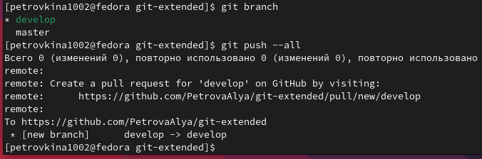{width=70%}

## Выполнение лабораторной работы

Устанавливаю внешнюю ветку как вышестоящую для этой ветке (рис.13).

{width=70%}

## Выполнение лабораторной работы

Cоздаю релиз с версией 1.0.0 (рис.14).

{width=50%}

Cоздаю журнал изменений и добавляю его в индекс (рис.15).

## Выполнение лабораторной работы

{width=70%}

## Выполнение лабораторной работы

Заливаю релизную ветку в основную ветку (рис.16).

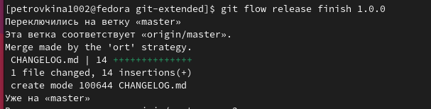{width=70%}

## Выполнение лабораторной работы

Отправляю данные на github (рис.17).

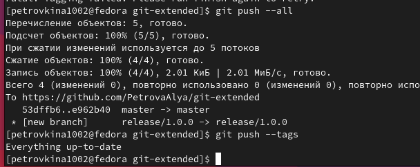{width=70%}

## Выполнение лабораторной работы

Создаю релиз на GitHub (рис.18).

{width=70%}

## Выполнение лабораторной работы

Создаю ветку для новой функциональности (рис.19)

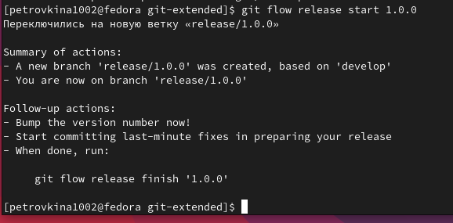{width=70%}

## Выполнение лабораторной работы

Обновляю  файл package.json и создаю журнал изменений, добавля. журнал в индекс (рис. 20)
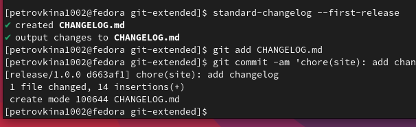{width=70%}

## Выполнение лабораторной работы

Отправляю эти дпнные на GitHub (рис.21)

{width=70%}

## Выполнение лабораторной работы

Создаю релиз на github с комментарием из журнала изменений (рис.22)

{width=70%}

## Выполнение лабораторной работы

Проверяю результат

{width=70%}

## Выводы

В ходе работы я получила навыки правильной работы с репозиториями git .

## Список литературы{.unnumbered}

::: Лабораторная работа №4 Операционные системы 
:::
