---
## Front matter
title: "Отчёт по Лабораторной работе №4"
subtitle: "Операционные системы"
author: "Петрова Алевтина Александровна"

## Generic otions
lang: ru-RU
toc-title: "Содержание"

## Bibliography
bibliography: bib/cite.bib
csl: pandoc/csl/gost-r-7-0-5-2008-numeric.csl

## Pdf output format
toc: true # Table of contents
toc-depth: 2
lof: true # List of figures
lot: true # List of tables
fontsize: 12pt
linestretch: 1.5
papersize: a4
documentclass: scrreprt
## I18n polyglossia
polyglossia-lang:
  name: russian
  options:
	- spelling=modern
	- babelshorthands=true
polyglossia-otherlangs:
  name: english
## I18n babel
babel-lang: russian
babel-otherlangs: english
## Fonts
mainfont: PT Serif
romanfont: PT Serif
sansfont: PT Sans
monofont: PT Mono
mainfontoptions: Ligatures=TeX
romanfontoptions: Ligatures=TeX
sansfontoptions: Ligatures=TeX,Scale=MatchLowercase
monofontoptions: Scale=MatchLowercase,Scale=0.9
## Biblatex
biblatex: true
biblio-style: "gost-numeric"
biblatexoptions:
  - parentracker=true
  - backend=biber
  - hyperref=auto
  - language=auto
  - autolang=other*
  - citestyle=gost-numeric
## Pandoc-crossref LaTeX customization
figureTitle: "Рис."
tableTitle: "Таблица"
listingTitle: "Листинг"
lofTitle: "Список иллюстраций"
lotTitle: "Список таблиц"
lolTitle: "Листинги"
## Misc options
indent: true
header-includes:
  - \usepackage{indentfirst}
  - \usepackage{float} # keep figures where there are in the text
  - \floatplacement{figure}{H} # keep figures where there are in the text
---

# Цель работы

Получение навыков правильной работы с репозиториями git.

# Задание
Выполнить работу для тестового репозитория. 
Преобразовать рабочий репозиторий в репозиторий с git-flow и conventional commits.

# Теоретическое введение

Gitflow Workflow опубликована и популяризована Винсентом Дриссеном. 
Gitflow Workflow предполагает выстраивание строгой модели ветвления с учётом выпуска проекта.
 Данная модель отлично подходит для организации рабочего процесса на основе релизов. 
 Работа по модели Gitflow включает создание отдельной ветки для исправлений ошибок в рабочей среде. 
 Последовательность действий при работе по модели Gitflow: Из ветки master создаётся ветка develop. 
 	Из ветки develop создаётся ветка release. 
	Из ветки develop создаются ветки feature. 
	Когда работа над веткой feature завершена, она сливается с веткой develop. 
	Когда работа над веткой релиза release завершена, она сливается в ветки develop и master. 
	Если в master обнаружена проблема, из master создаётся ветка hotfix. 
	Когда работа над веткой исправления hotfix завершена, она сливается в ветки develop и master.

# Выполнение лабораторной работы

Устанавливаю gitflow (рис.1).

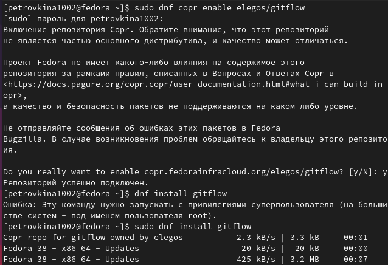{#fig:001 width=70%}

Устанавливаю gitflow (рис.2).

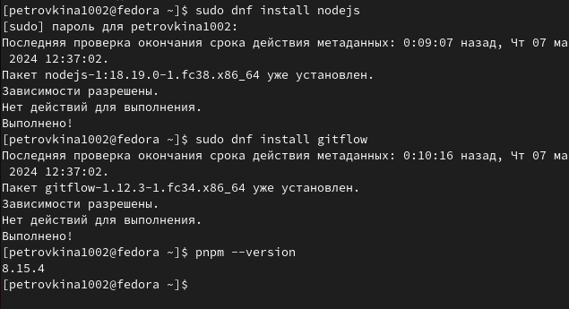{#fig:002 width=70%}

Для работы с NODE.JS добавим каталог с исполняемыми файлами. Запускаю, используя команду pnpm setup (рис.3).

{#fig:003 width=70%}

Выполняю команду source ~/.bash.rc. Добавляю программу,которая используется для помощи в форматировании коммитов  (рис.4).

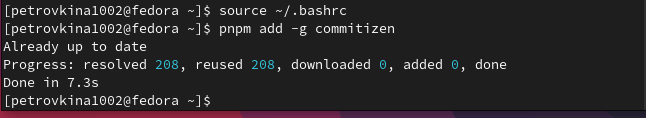{#fig:004 width=70%}

Добавляю программу, для помощи в созданиии логов (рис.5).

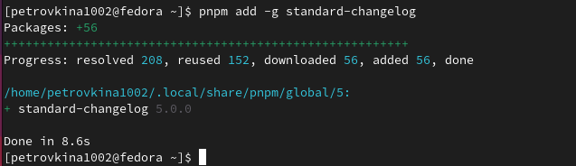{#fig:005 width=70%}

Создаю пустой файл в новый репозиторий, делаю первый коммит и выкладываю на github (рис.6).

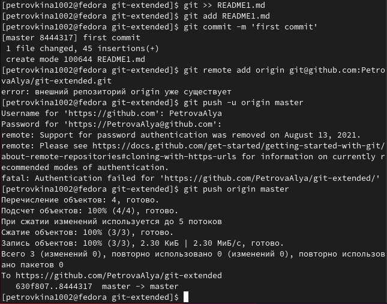{#fig:006 width=70%}

Проверяю изменения (рис.7).

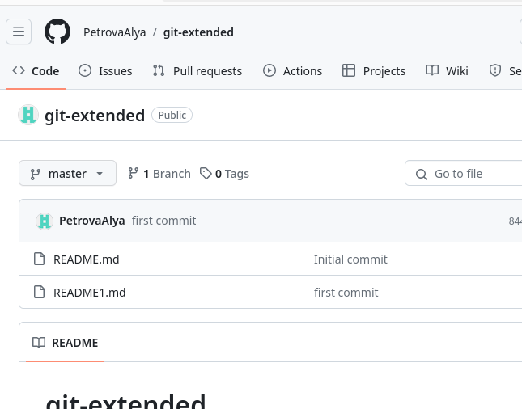{#fig:007 width=70%}

Выполняю конфигурацию для пакетов NODE.js (рис.8).

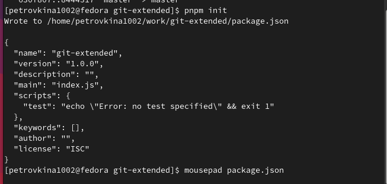{#fig:008 width=70%}

Изменяю файл package.json (рис.9).

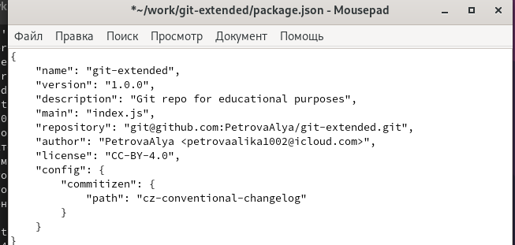{#fig:009 width=70%}

Добавляю новый файлы,выполняю коммит и отправляю изменения на github (рис.10).

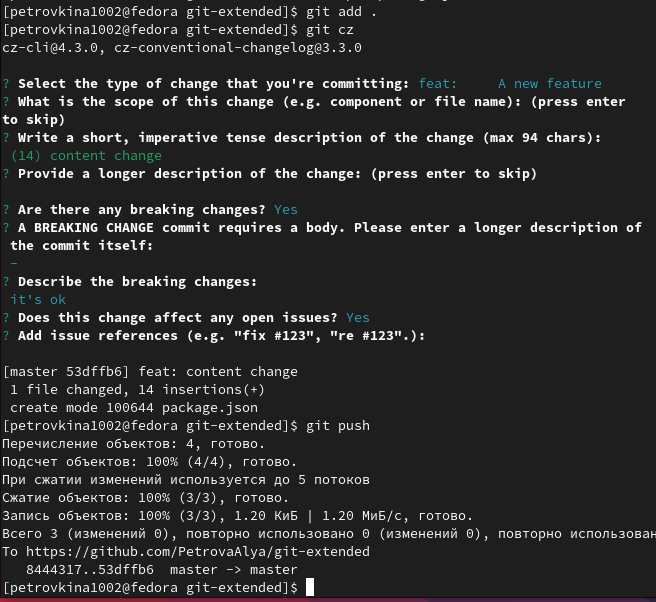{#fig:010 width=70%}

Инициализирую gitflow, префикс для ярлыков устанавливаю в v (рис.11).

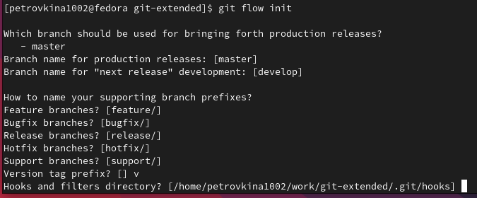{#fig:011 width=70%}

Проверяю,что нахожусь на ветке develop и отправляю весь репозиторий в хранилище (рис.12).

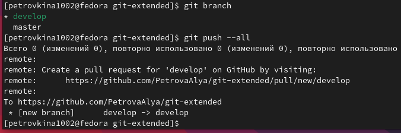{#fig:012 width=70%}

Устанавливаю внешнюю ветку как вышестоящую для этой ветке (рис.13).

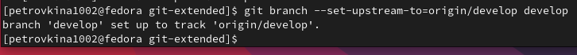{#fig:013 width=70%}

Cоздаю релиз с версией 1.0.0 (рис.14).

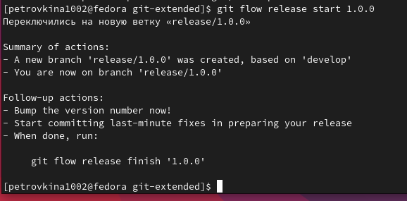{#fig:014 width=70%}

Cоздаю журнал изменений и добавляю его в индекс (рис.15).

{#fig:015 width=70%}

Заливаю релизную ветку в основную ветку (рис.16).

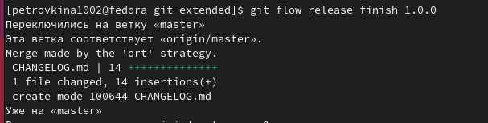{#fig:016 width=70%}

Отправляю данные на github (рис.17).

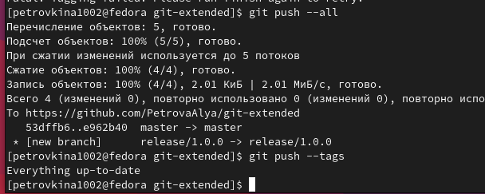{#fig:017 width=70%}

Создаю релиз на GitHub (рис.18).

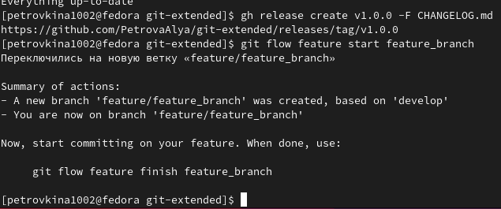{#fig:018 width=70%}

Создаю ветку для новой функциональности (рис.19)

{#fig:019 width=70%}

Обновляю  файл package.json и создаю журнал изменений, добавля. журнал в индекс (рис. 20)
{#fig:020 width=70%}

Отправляю эти дпнные на GitHub (рис.21)

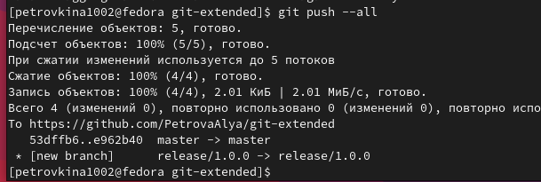{#fig:021 width=70%}

Создаю релиз на github с комментарием из журнала изменений (рис.22)

{#fig:022 width=70%}

Проверяю результат

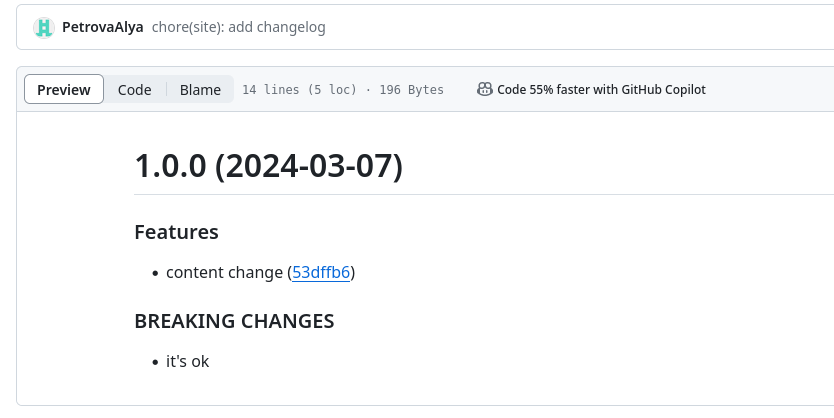{#fig:023 width=70%}

# Выводы

В ходе работы я получила навыки правильной работы с репозиториями git .

# Список литературы{.unnumbered}

::: Лабораторная работа №4 Операционные системы 
:::
