---
## Front matter
lang: ru-RU
title: Презентация Лабораторной работы №5
subtitle: Операционные системы
author:
  - Петрова А.А.
institute:
  - Российский университет дружбы народов, Москва, Россия
  
date: 09 марта 2024

## i18n babel
babel-lang: russian
babel-otherlangs: english

## Formatting pdf
toc: false
toc-title: Содержание
slide_level: 2
aspectratio: 169
section-titles: true
theme: metropolis
header-includes:
 - \metroset{progressbar=frametitle,sectionpage=progressbar,numbering=fraction}
 - '\makeatletter'
 - '\beamer@ignorenonframefalse'
 - '\makeatother'
---

## Цель работы
Приобрести навыки работы с менеджерами паролей и файлами конфигураций и настроить рабочую среду

## Задание
Провести установку и настройку менеджера паролей Pass
Научиться использовать chezmoi для управления файлами конфигурации домашнего каталога пользователя

## Выполнение лабораторной работы

Провожу установку менеджера паролей  (рис .1)

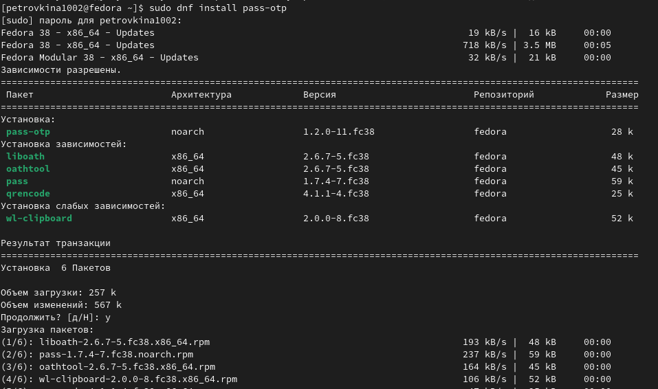{width=40% }

## Выполнение лабораторной работы

Продолжаю установку с помощью другой команды  (рис.2)

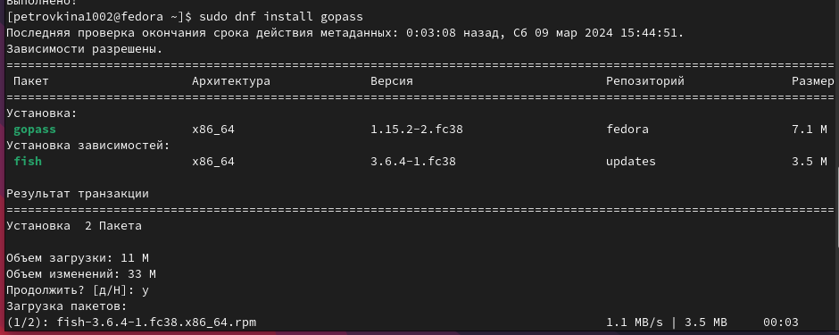{width=70%}

## Выполнение лабораторной работы

Просматриваю список ключей GPG (рис.3)

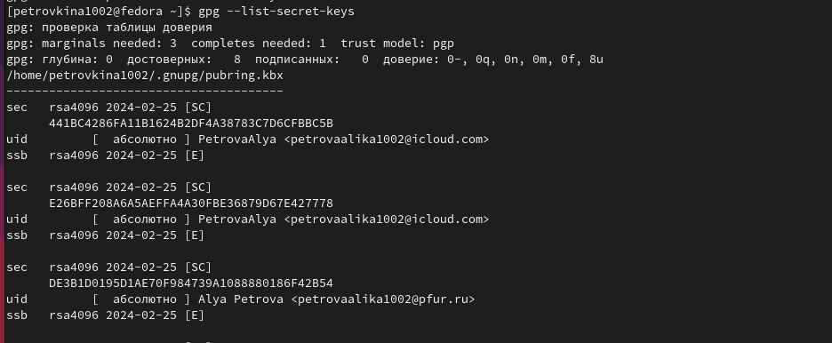{width=70%}

## Выполнение лабораторной работы

Инициализирую хранилище, используя почту, привязанную к аккаунту Github (рис.4)

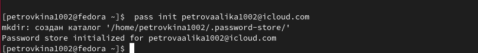{width=70%}

## Выполнение лабораторной работы

Создаю структуру git для ее синхронизации(рис.5)

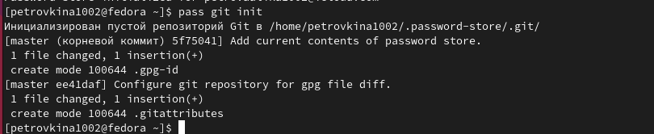{width=70%}

## Выполнение лабораторной работы

Создав новый репозиторий, задаю его адрес на хостинге (рис.6)

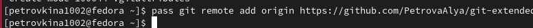{width=70%}

## Выполнение лабораторной работы

Вручную выкладываю изменения репозитория (рис.7)

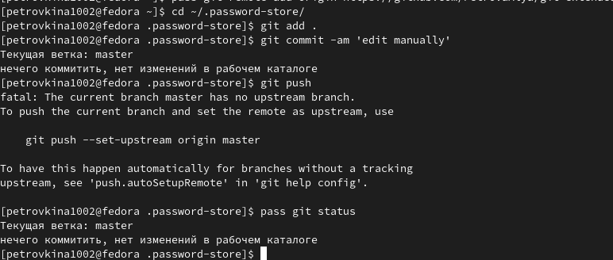{width=60%}

## Выполнение лабораторной работы

Устанавливаю необходимый плагин для работы с интерфейсом native messaging(рис.8)

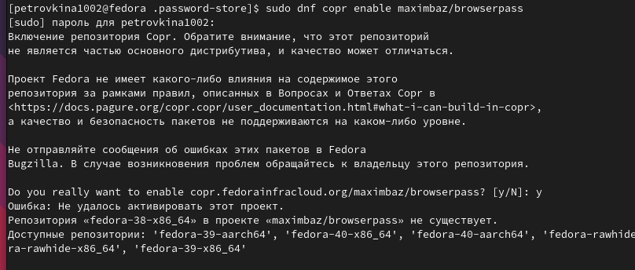{width=60%}

## Выполнение лабораторной работы

Провожу установку необходимого ПО для управления файлами конфигурации (рис.9)

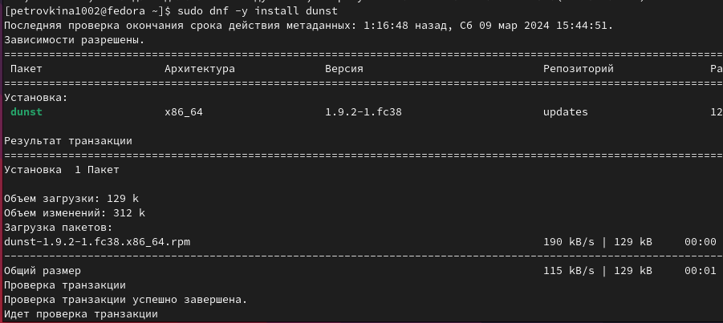{width=60%}

## Выполнение лабораторной работы

Устанавливаю необходимые шрифты с помощью ряда команд (рис.10)

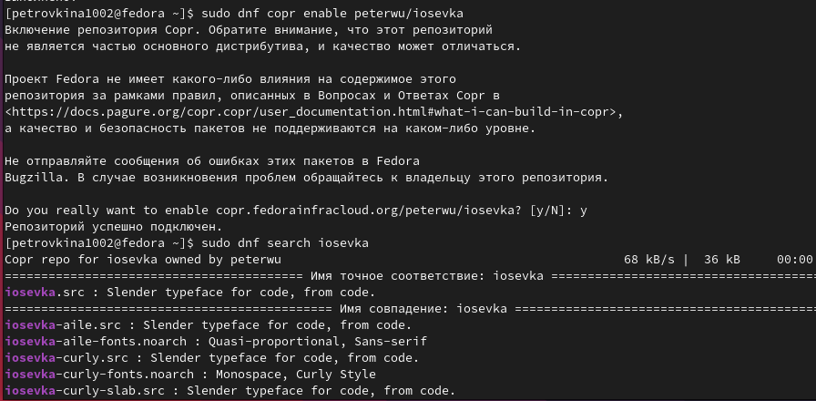{width=50%}

## Выполнение лабораторной работы

Продолжаю установку шрифтов (рис.11)

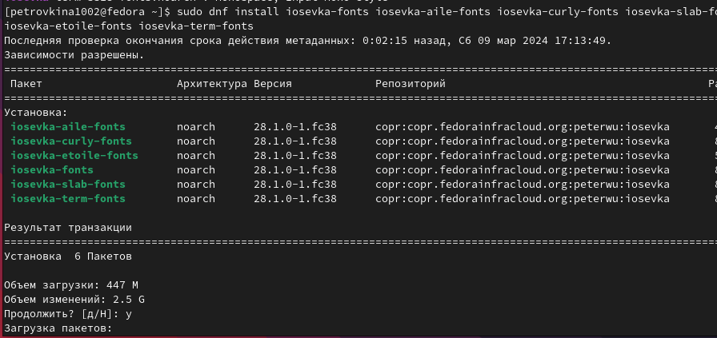{width=50%}

## Выполнение лабораторной работы

Устанавливаю бинарный файл с помощью wget: sh -c "$(wget -qO- chezmoi.io/get)" (рис.12)

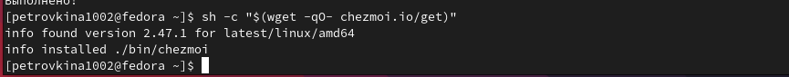{width=70%}

## Выполнение лабораторной работы

С помощью утилиты gh repo create dotfiles создаю репозиторий на основе необходимого шаблона (рис.13)

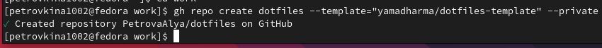{width=70%}

## Выполнение лабораторной работы

Инициализирую chezmoi с моим репозиторием dotfiles (рис.14)

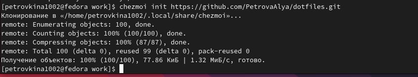{width=70%}

## Выполнение лабораторной работы

Проверяю внесенные изменения с помощью chezmoi diff
После этого запускаю chezmoi apply -v (рис.15)

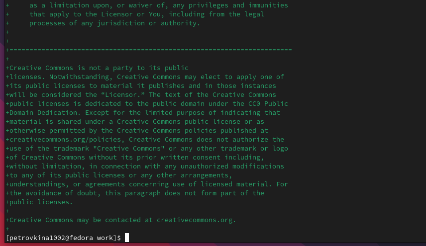{width=40%}

## Выполнение лабораторной работы

Далее, инициализировав chezmoi с моим репозиторием dotfiles на второй машине, я также проверяю внесенные изменения, но на этот раз их корректирую и потом уже применяю последние изменения из моего репозитория (рис.16)

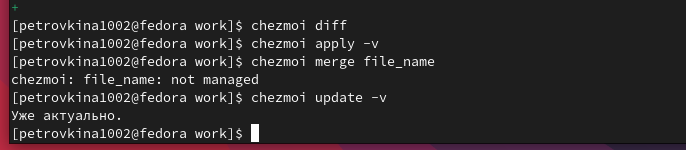{width=70%}

## Выполнение лабораторной работы

Устанавливаю свои dotfiles на новый компьютер (рис. 17)

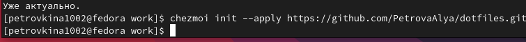{width=70%}

## Выполнение лабораторной работы

Прописываю команду chezmoi update, чтобы извлечь изменения из репозитория и применить их одной командой (рис.18)

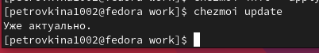{ width=70%}

## Выполнение лабораторной работы

Далее я извлекаю последние изменения из своего репозитория (рис.19)

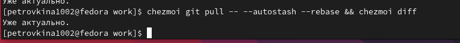{width=70%}

## Выполнение лабораторной работы

Проверяю, включена ли функция автоматического фиксирования и отправления изменений в репозиторий, открыв файл конфигурации ~/.config/chezmoi/chezmoi.toml (рис.20)

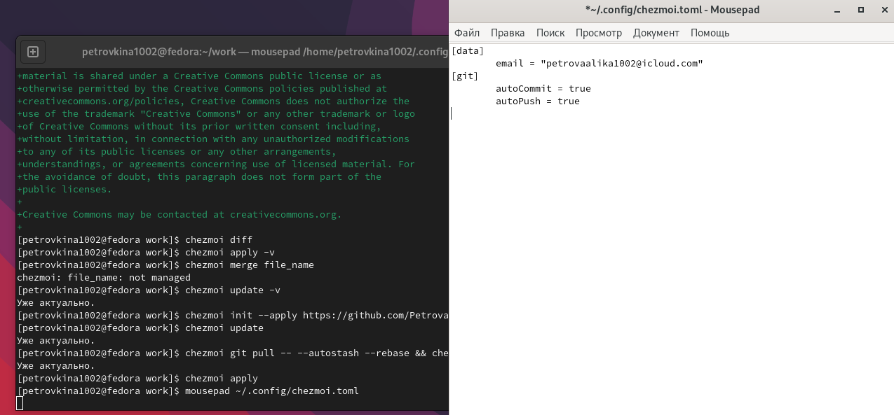{width=40%}

## Выводы

В ходе работы я приобрела навыки работы с менеджерами паролей и файлами конфигураций и настроила рабочую среду

## Список литературы

 {Лабораторная работа №5 - электронная версия} URL: https://esystem.rudn.ru/mod/page/view.php?id=1098796&forceview=1

