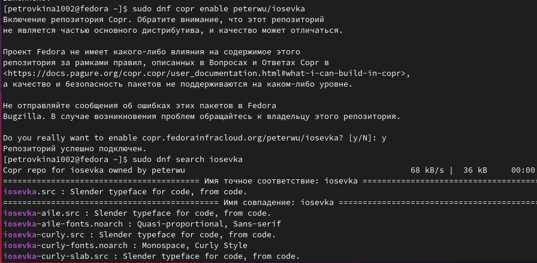

---
## Front matter
title: "Лабораторная работа №5"
subtitle: "Операционные системы"
author: "Петрова Алевтина Александровна"

## Generic otions
lang: ru-RU
toc-title: "Содержание"

## Bibliography
bibliography: bib/cite.bib
csl: pandoc/csl/gost-r-7-0-5-2008-numeric.csl

## Pdf output format
toc: true # Table of contents
toc-depth: 2
lof: true # List of figures
lot: true # List of tables
fontsize: 12pt
linestretch: 1.5
papersize: a4
documentclass: scrreprt
## I18n polyglossia
polyglossia-lang:
  name: russian
  options:
	- spelling=modern
	- babelshorthands=true
polyglossia-otherlangs:
  name: english
## I18n babel
babel-lang: russian
babel-otherlangs: english
## Fonts
mainfont: PT Serif
romanfont: PT Serif
sansfont: PT Sans
monofont: PT Mono
mainfontoptions: Ligatures=TeX
romanfontoptions: Ligatures=TeX
sansfontoptions: Ligatures=TeX,Scale=MatchLowercase
monofontoptions: Scale=MatchLowercase,Scale=0.9
## Biblatex
biblatex: true
biblio-style: "gost-numeric"
biblatexoptions:
  - parentracker=true
  - backend=biber
  - hyperref=auto
  - language=auto
  - autolang=other*
  - citestyle=gost-numeric
## Pandoc-crossref LaTeX customization
figureTitle: "Рис."
tableTitle: "Таблица"
listingTitle: "Листинг"
lofTitle: "Список иллюстраций"
lotTitle: "Список таблиц"
lolTitle: "Листинги"
## Misc options
indent: true
header-includes:
  - \usepackage{indentfirst}
  - \usepackage{float} # keep figures where there are in the text
  - \floatplacement{figure}{H} # keep figures where there are in the text
---

# Цель работы
Приобрести навыки работы с менеджерами паролей и файлами конфигураций и настроить рабочую среду

# Задание
Провести установку и настройку менеджера паролей Pass
Научиться использовать chezmoi для управления файлами конфигурации домашнего каталога пользователя

# Выполнение лабораторной работы

Провожу установку менеджера паролей через команду dnf install pass pass-otp (рис .1)

{ #fig:001 width=70% }

Продолжаю установку с помощью команды dnf install gopass (рис.2)

{ #fig:002 width=70% }

Просматриваю список ключей GPG (рис.3)

{ #fig:003 width=70% }

Инициализирую хранилище, используя почту, привязанную к аккаунту Github (рис.4)

{ #fig:004 width=70% }

Создаю структуру git для ее синхронизации(рис.5)

{ #fig:005 width=70% }

Создав новый репозиторий, задаю его адрес на хостинге (рис.6)

{ #fig:006 width=70% }

Вручную выкладываю изменения репозитория (рис.7)

{ #fig:007 width=70% }

Устанавливаю необходимый плагин для работы с интерфейсом native messaging(рис.8)

{ #fig:008 width=70% }

Провожу установку необходимого ПО для управления файлами конфигурации (рис.9)

{ #fig:009 width=70% }

Устанавливаю необходимые шрифты с помощью ряда команд (рис.10)

{ #fig:010 width=70% }

Продолжаю установку шрифтов (рис.11)

{ #fig:011 width=70% }

Устанавливаю бинарный файл с помощью wget: sh -c "$(wget -qO- chezmoi.io/get)" (рис.12)

{ #fig:012 width=70% }

С помощью утилиты gh repo create dotfiles создаю репозиторий на основе необходимого шаблона (рис.13)

{ #fig:013 width=70% }

Инициализирую chezmoi с моим репозиторием dotfiles (рис.14)

{ #fig:014 width=70% }

Проверяю внесенные изменения с помощью chezmoi diff
После этого запускаю chezmoi apply -v (рис.15)

{ #fig:015 width=70% }

Далее, инициализировав chezmoi с моим репозиторием dotfiles на второй машине, я также проверяю внесенные изменения, но на этот раз их корректирую и потом уже применяю последние изменения из моего репозитория (рис.16)

{ #fig:016 width=70% }

Устанавливаю свои dotfiles на новый компьютер (рис. 17)

{ #fig:017 width=70% }

Прописываю команду chezmoi update, чтобы извлечь изменения из репозитория и применить их одной командой (рис.18)

{ #fig:018 width=70% }

Далее я извлекаю последние изменения из своего репозитория и смотрю, что изменится, фактически не применяя изменения, проверяю и лишь затем их применяю (рис.19)

{ #fig:019 width=70% }

Проверяю, включена ли функция автоматического фиксирования и отправления изменений в репозиторий, открыв файл конфигурации ~/.config/chezmoi/chezmoi.toml (рис.20)

{ #fig:020 width=70% }

# Выводы

В ходе работы я приобрела навыки работы с менеджерами паролей и файлами конфигураций и настроила рабочую среду

# Список литературы

::: {Лабораторная работа №5 - электронная версия} URL: https://esystem.rudn.ru/mod/page/view.php?id=1098796&forceview=1
:::

