---
## Front matter
lang: ru-RU
title: Презентация Лабораторной работы №6
subtitle: Операционные системы
author:
  - Петрова А.А.
institute:
  - Российский университет дружбы народов, Москва, Россия
  
date: 14 марта 2024

## i18n babel
babel-lang: russian
babel-otherlangs: english

## Formatting pdf
toc: false
toc-title: Содержание
slide_level: 2
aspectratio: 169
section-titles: true
theme: metropolis
header-includes:
 - \metroset{progressbar=frametitle,sectionpage=progressbar,numbering=fraction}
 - '\makeatletter'
 - '\beamer@ignorenonframefalse'
 - '\makeatother'
---

## Цель работы

Цель данной лабораторной работы -- приобретение практических навыков взаимодействия пользователя с системой посредством командной строки.

## Задание

1. Определить полное имя домашнего каталога.
2. Выполнить следующие действия:
- Перейти в каталог /tmp.
- Вывести на экран содержимое каталога /tmp.
- Определить, есть ли в каталоге /var/spool подкаталог с именем cron.
- Перейти в домашний каталог и вывести на экран его содержимое. Определить, кто является владельцем файлов и подкаталогов.
3. Выполнить следующие действия:
- В домашнем каталоге создать новый каталог с именем newdir.
- В каталоге ~/newdir создать новый каталог с именем morefun.
- В домашнем каталоге создать одной командой три новых каталога с именами
letters, memos, misk. Затем удалить эти каталоги одной командой.
- Попробовать удалить ранее созданный каталог ~/newdir командой rm. Проверть,
был ли каталог удалён.
- Удалить каталог ~/newdir/morefun из домашнего каталога. Проверить, был ли
каталог удалён.
4. С помощью команды man определить, какую опцию команды ls нужно использовать для просмотра содержимого не только указанного каталога, но и подкаталогов,
входящих в него.
5. С помощью команды man определить набор опций команды ls, позволяющий отсортировать по времени последнего изменения выводимый список содержимого каталога
с развёрнутым описанием файлов.
6. Использовать команду man для просмотра описания следующих команд: cd, pwd, mkdir,
rmdir, rm. Поясните основные опции этих команд.
7. Используя информацию, полученную при помощи команды history, выполнить модификацию и исполнение нескольких команд из буфера команд.

## Теоретическое введение

В операционной системе типа Linux взаимодействие пользователя с системой обычно
осуществляется с помощью командной строки посредством построчного ввода команд. При этом обычно используется командные интерпретаторы языка shell: /bin/sh;
/bin/csh; /bin/ksh.

Командой в операционной системе называется записанный по
специальным правилам текст (возможно с аргументами), представляющий собой указание на выполнение какой-либо функций (или действий) в операционной системе.
Обычно первым словом идёт имя команды, остальной текст — аргументы или опции,
конкретизирующие действие.

Общий формат команд можно представить следующим образом:
<имя_команды><разделитель><аргументы>
Команда man. Команда man используется для просмотра (оперативная помощь) в диалоговом режиме руководства (manual) по основным командам операционной системы
типа Linux.

Формат команды:
man <команда>

Файловая система ОС типа Linux — иерархическая система каталогов,
подкаталогов и файлов, которые обычно организованы и сгруппированы по функциональному признаку. Самый верхний каталог в иерархии называется корневым
и обозначается символом /. Корневой каталог содержит системные файлы и другие
каталоги.

В работе с командами, в качестве аргументов которых
выступает путь к какому-либо каталогу или файлу, можно использовать сокращённую
запись пути.

## Выполнение лабораторной работы

Полное имя домашнего каталога можно узнать с помощью утилиты pwd (рис.1).

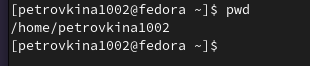{#fig:001 width=70%}

## Выполнение лабораторной работы

Перехожу в подкаталог tmp корневого каталога (рис.2).

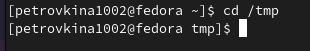{#fig:002 width=70%}

## Выполнение лабораторной работы

Просматриваю содержимое каталога tmp (рис.3).

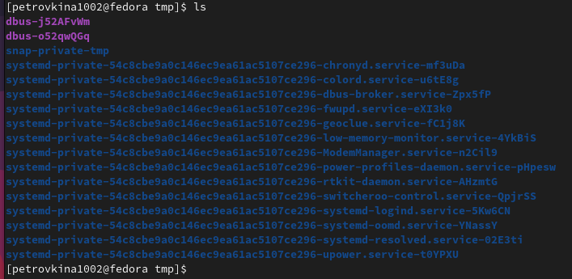{#fig:003 width=70%}

## Выполнение лабораторной работы

Пробую использовать команду ls с разными опциями. (рис.4).

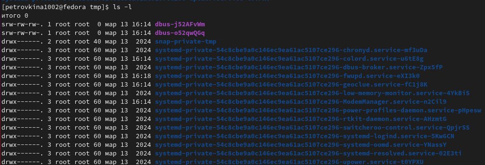{#fig:004 width=70%}

## Выполнение лабораторной работы

Опция -a покажет скрытые файлы в каталоге (рис.5).

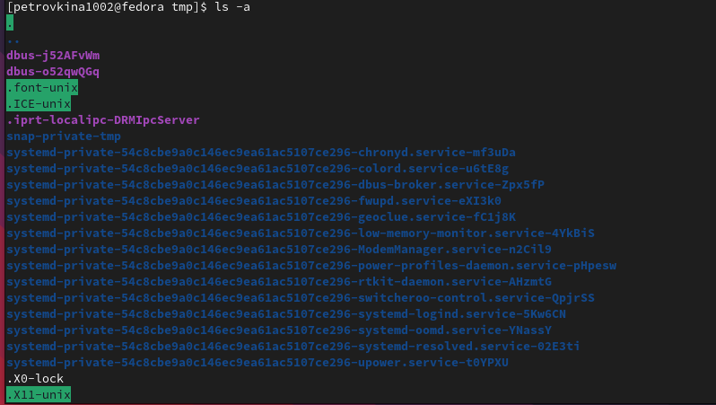{#fig:005 width=50%}

## Выполнение лабораторной работы

Перехожу в каталог /var/spool/ с помощью cd.
Воспользуемся утилитой ls с флагом -F, чтобы проверить, что мы найдем именно каталог.  (рис.6).

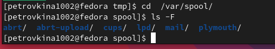{#fig:006 width=70%}

## Выполнение лабораторной работы

Возвращаюсь в домашний каталог, для этого . Затем проверяю содержимое каталога с помощью утилиты ls (рис.7).

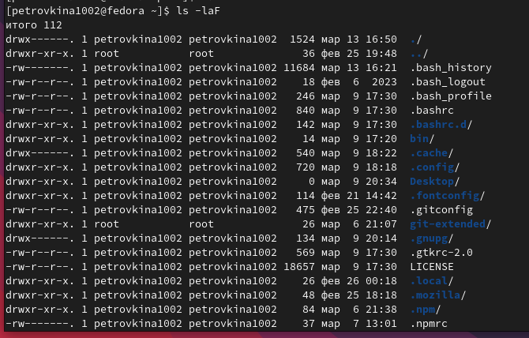{#fig:007 width=50%}

## Выполнение лабораторной работы

Создаю директорию newdir с помощью утилиты mkdir, затем проверяю, что директория создалась (рис.8).

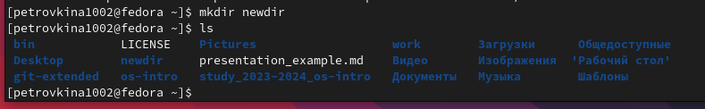{#fig:008 width=70%}

## Выполнение лабораторной работы

Создаю для каталога newdir подкаталог morefun, проверяю, что каталог собран (рис. 9).

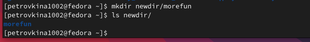{#fig:009 width=70%}

## Выполнение лабораторной работы

Чтобы создать несколько директорий одной строчкой нужно перечислить назваания директорий через пробел после утилиты mkdir (рис.10). 

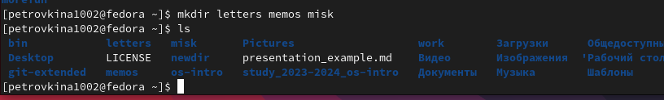{#fig:010 width=70%}

## Выполнение лабораторной работы

Чтобы удалить несколько пустых директорий одной строчкой нужно перечислить назваания директорий через пробел после утилиты rmdir (рис.11). 

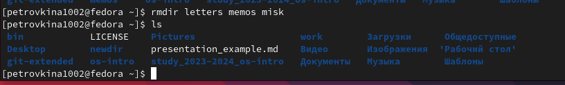{#fig:011 width=70%}

## Выполнение лабораторной работы

Пытаюсь удалить newdir с помощью rm. Утилита rm по умолчанию удаляет файлы (рис.12).

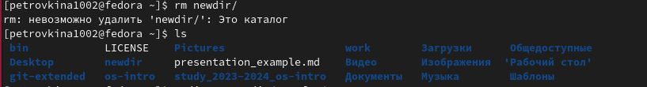{#fig:012 width=70%}

## Выполнение лабораторной работы

Удаляю директорию newdir с помощью утилиты rmdir (рис.13).

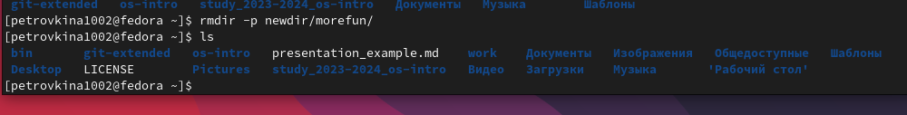{#fig:013 width=70%}

## Выполнение лабораторной работы

С помощью команды man ls я могу прочесть документацию к команде ls, опция, которая позолит выводить все подкаталоги каталогов предоставлена на скриншоте, это -R (рис.14).

{#fig:014 width=70%}

## Выполнение лабораторной работы

Так как мне нужно найти опцию утилиты ls для сортировки, то логично сузить поиск до резуьтатов с таким же вопросом (рис.15). Выяснила, что для сортировки и выводда информации нужна комбинация опций -lt.

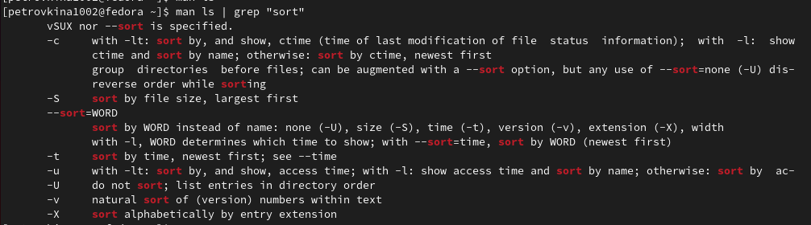{#fig:015 width=70%}

## Выполнение лабораторной работы

С помощью man cd узнаю описание команды cd и ее опции. Основных опций немного (рис. 16).

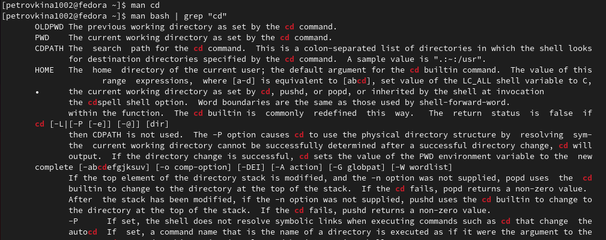{#fig:016 width=50%}

## Выполнение лабораторной работы

С помощью man pwd узнаю описание команды pwd и ее опции (рис.17).

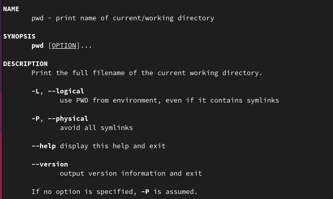{#fig:017 width=70%}

## Выполнение лабораторной работы

С помощью man mkdir узнаю описание команды mkdir и ее опции (рис.18).

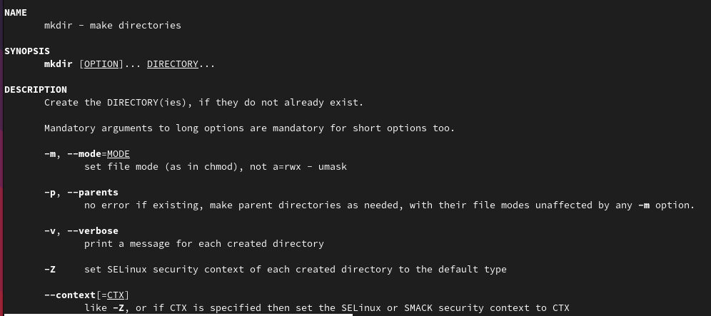{#fig:018 width=50%}

## Выполнение лабораторной работы

С помощью man rmdir узнаю описание команды rmdir и ее опции (рис.19).

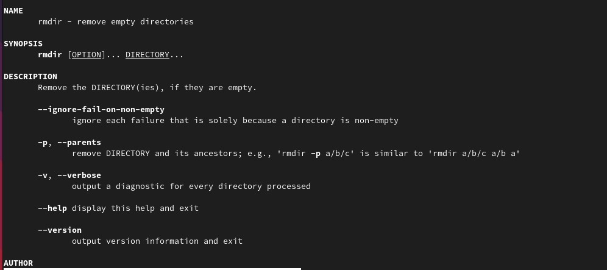{#fig:019 width=50%}

## Выполнение лабораторной работы

С помощью man rm узнаю описание команды rm и ее опции (рис.20).

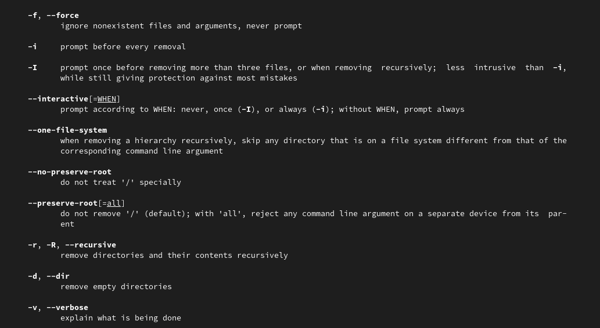{#fig:020 width=40%}

## Выполнение лабораторной работы

Опции --help --version применимы почти ко всем утилитам, они показывают справку по команде и ее версию соответственно.

Вывела историю команд с помощью утилиты history рис.21).

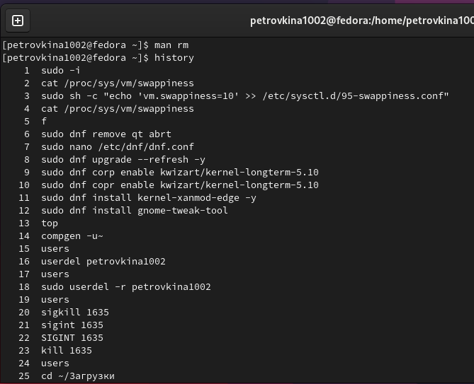{#fig:021 width=50%}

## Выполнение лабораторной работы

Модифицировала команду (рис. @fig:022).

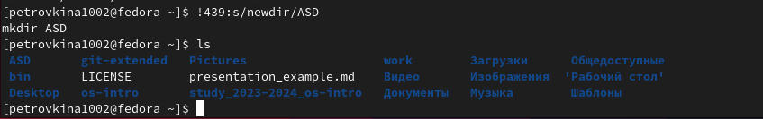{#fig:022 width=70%}

## Выполнение лабораторной работы

Модифицировала команду (рис.23).

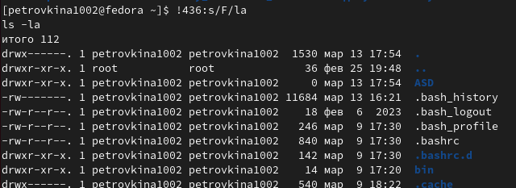{#fig:023 width=70%}

## Выводы

Я приобрела практические навыки взаимодействия пользователя с системой посредством командной строки.

## Список литературы
Лабораторная работа №6 Операционные системы
