---
## Front matter
lang: ru-RU
title:  Презентация лабораторной работы №8
subtitle: Операционные системы
author:
  - Петрова А. А.
institute:
  - Российский университет дружбы народов, Москва, Россия
  
date: 28 марта 2024

## i18n babel
babel-lang: russian
babel-otherlangs: english

## Formatting pdf
toc: false
toc-title: Содержание
slide_level: 2
aspectratio: 169
section-titles: true
theme: metropolis
header-includes:
 - \metroset{progressbar=frametitle,sectionpage=progressbar,numbering=fraction}
 - '\makeatletter'
 - '\beamer@ignorenonframefalse'
 - '\makeatother'
---

## Цель работы

Цель данной лабораторной работы - ознакомление с инструментами поиска файлов и фильтрации текстовых данных, а также приобретение практических навыков по управлению процессами (и заданиями), по проверке использования диска и по обслуживанию файловых систем.

## Задание

1. Осуществите вход в систему, используя соответствующее имя пользователя.
2. Запишите в файл file.txt названия файлов, содержащихся в каталоге /etc. Допи-
шите в этот же файл названия файлов, содержащихся в вашем домашнем каталоге.
3. Выведите имена всех файлов из file.txt, имеющих расширение .conf, после чего
запишите их в новый текстовой файл conf.txt.
4. Определите, какие файлы в вашем домашнем каталоге имеют имена, начинавшиеся
с символа c? Предложите несколько вариантов, как это сделать.
5. Выведите на экран (по странично) имена файлов из каталога /etc, начинающиеся
с символа h.
6. Запустите в фоновом режиме процесс, который будет записывать в файл ~/logfile
файлы, имена которых начинаются с log.
7. Удалите файл ~/logfile.
8. Запустите из консоли в фоновом режиме редактор gedit.
9. Определите идентификатор процесса gedit, используя команду ps, конвейер и фильтр
grep. Как ещё можно определить идентификатор процесса?
10. Прочтите справку (man) команды kill, после чего используйте её для завершения
процесса gedit.
11. Выполните команды df и du, предварительно получив более подробную информацию
об этих командах, с помощью команды man.
12. Воспользовавшись справкой команды find, выведите имена всех директорий, имею-
щихся в вашем домашнем каталоге.

## Теоретическое введение

В интерфейсе командной строки есть очень полезная возможность перенаправления (переадресации) ввода и вывода (англ. термин I/O Redirection). Как мы уже заметили, многие программы выводят данные на экран. А ввод данных в терминале осуществляется с клавиатуры. С помощью специальных обозначений можно перенаправить вывод многих команд в файлы или иные устройства вывода (например, распечатать на принтере). Тоже самое и со вводом информации, вместо ввода данных с клавиатуры, для многих программ можно задать считывание символов их файла. Кроме того, можно даже вывод одной программы передать на ввод другой программе.

К каждой программе, запускаемой в командной строке, по умолчанию подключено три потока данных:

STDIN (0) — стандартный поток ввода (данные, загружаемые в программу). STDOUT (1) — стандартный поток вывода (данные, которые выводит программа). По умолчанию — терминал. STDERR (2) — стандартный поток вывода диагностических и отладочных сообщений (например, сообщениях об ошибках). По умолчанию — терминал.

Pipe (конвеер) – это однонаправленный канал межпроцессного взаимодействия. Термин был придуман Дугласом Макилроем для командной оболочки Unix и назван по аналогии с трубопроводом. Конвейеры чаще всего используются в shell-скриптах для связи нескольких команд путем перенаправления вывода одной команды (stdout) на вход (stdin) последующей, используя символ конвеера ‘|’.

## Выполнение лабораторной работы

Я вошла в систему под соотвествующим именем пользователя, открыла терминал, записала в файл file.txt названия файлов из каталога /etc с помощью перенаправления ">" (и файл создала, и записала в него то, что могло быть выведено ls -lR /etc). В файл я добавила также все файлы из подкаталогов (рис.1).

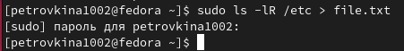

## Выполнение лабораторной работы

Проверила, что в файл записались нужные значения с помощью утилиты head, она выводит первые 10 строк файла на экран (рис.2).

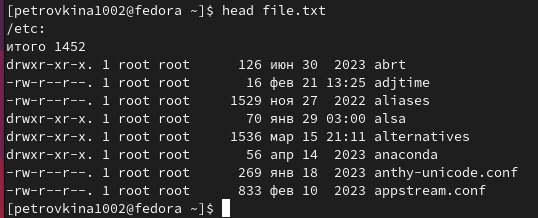

## Выполнение лабораторной работы

Добавила в созданный файл имена файлов из домашнего каталога, используя перенаправление ">>" в режиме добавления (рис.3).

## Выполнение лабораторной работы

Вывела на экран имена всех файлов, имеющих расширение ".conf" с помощью утилиты grep (рис.4).

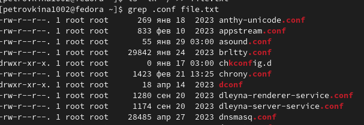

## Выполнение лабораторной работы

Добавила вывод прошлой команды в новый файл conf.txt с помощью перенаправления ">" (файл создается при выполнении этой команды) (рис.5).

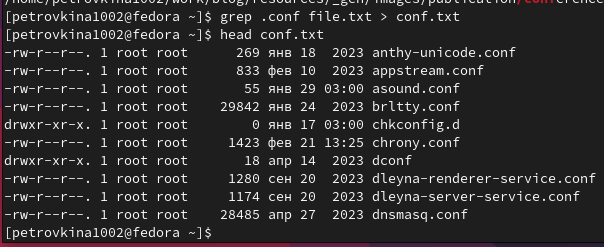

## Выполнение лабораторной работы

Определяю,какие файлы в домашнем каталоге начинаютя с символа "c" с помощью утилиты find,

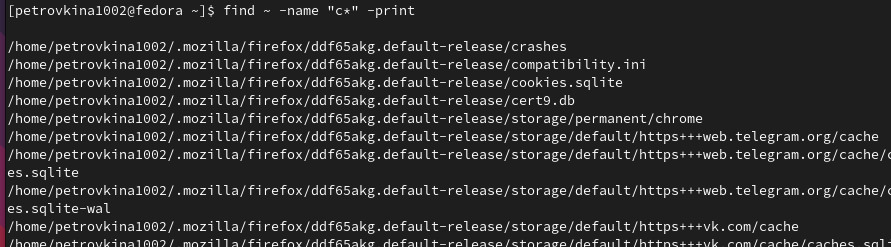

## Выполнение лабораторной работы

Второй способ использовать утилиту ls -lR и использовать grep, чтобы найти элементы с первым символом c.  (рис.7).

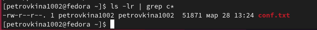

## Выполнение лабораторной работы

С помощью метода find, чьи опции я расписала ранее, ищу все файлы, начинающиеся с буквы "h" (рис.8).

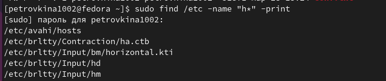

## Выполнение лабораторной работы

Запускаю в фоновом режиме процесс, который будет записывать в файл logfile (с помощью перенаправления >) файлы, имена которых начинаются с log (рис.9).

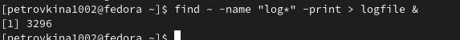

## Выполнение лабораторной работы

Проверяю, что файл создан, удаляю его, проверяю, что файл удален (рис.10).

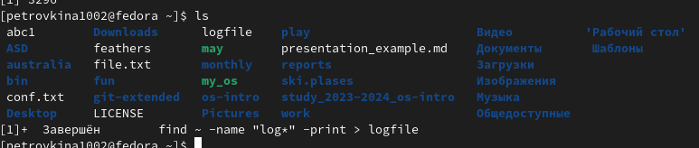

## Выполнение лабораторной работы

Запускаю в консоли в фоновом режиме редактор mousepad (рис.11).

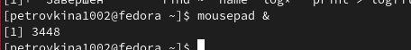

## Выполнение лабораторной работы

С помощью утилиты ps определяю идентификатор процесса mousepad(рис.12). 

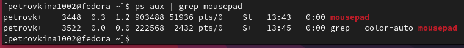

## Выполнение лабораторной работы

Прочитала справку команды kill (рис.13).

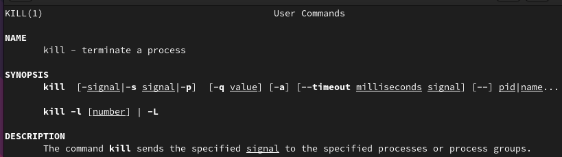

## Выполнение лабораторной работы

Использую команду kill и идентификатор процесса, чтобы его удалить (рис.14). 

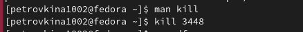

## Выполнение лабораторной работы

Прочитала документацию про функции df и du (рис.15).

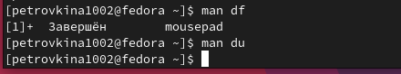

## Выполнение лабораторной работы

Использую утилиту df опции -iv позволяют увидеть информацию об инодах и сделать вывод читаемым, игнорируя сообщения системы о нем (рис.16). 

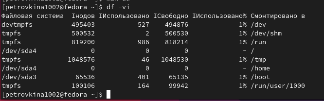

## Выполнение лабораторной работы

Использую утилиту du.  (рис.17).

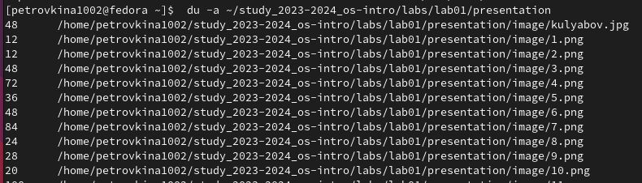

## Выполнение лабораторной работы

Прочитала документацию о команде find (рис.18).

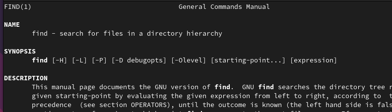{#fig:018 width=70%}

## Выполнение лабораторной работы

Вывела имена всех директорий, имеющихся в моем домашнем каталоге

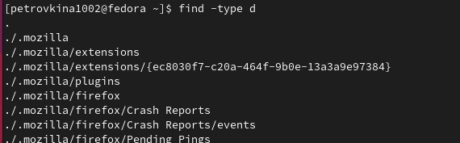

## Выводы

В результате данной лабораторной работы я ознакомилась с инструментами поиска файлов и фильтрации текстовых данных, а также приобрела практические навыки по управлению процессами (и заданиями), по проверке использования диска и по обслуживанию файловых систем.
