---
## Front matter
lang: ru-RU
title: Презентация второго этапа индивидуального проекта 
subtitle: Операционные системы
author:
  - Петрова А. А.
institute:
  - Российский университет дружбы народов, Москва, Россия
  
date: 16 марта 2024

## i18n babel
babel-lang: russian
babel-otherlangs: english

## Formatting pdf
toc: false
toc-title: Содержание
slide_level: 2
aspectratio: 169
section-titles: true
theme: metropolis
header-includes:
 - \metroset{progressbar=frametitle,sectionpage=progressbar,numbering=fraction}
 - '\makeatletter'
 - '\beamer@ignorenonframefalse'
 - '\makeatother'
---
## Цель работы

Продолжить работы со своим сайтом. Редактировать его в соответствии с требованиями. Добавить данные о себе.

## Задание

1. Разместить фотографию владельца сайта.
2. Разместить краткое описание владельца сайта (Biography).
3. Добавить информацию об интересах (Interests).
4. Добавить информацию от образовании (Education).
5. Сделать пост по прошедшей неделе.
6. Добавить пост на тему управление версиями. Git.

## Теоретическое введение

Hugo — генератор статических страниц для интернета.

**Коротко: что такое статические сайты**
    1. Статические сайты состоят из уже готовых HTML-страниц.
    2. Эти страницы собираются заранее, а не готовятся для пользователя «на лету». Для этого используют генераторы статичных сайтов.
    3. Так как это почти чистый HTML, то такие сайты быстрее загружаются и их проще переносить с сервера на сервер.
    4. Минус: если нужно что-то обновить на странице, то сначала это правят в исходном файле, а потом запускают обновление в генераторе.
    5. Ещё минус: такие страницы не подходят для интернет-магазинов или сайтов с личным кабинетом, потому что в статике нельзя сформировать страницу для каждого отдельного пользователя.

## Выполнение лабораторной работы

Добавила свою фотографию в папку blog/content/authors/admin, удалила фотографию шаблона (рис.1).

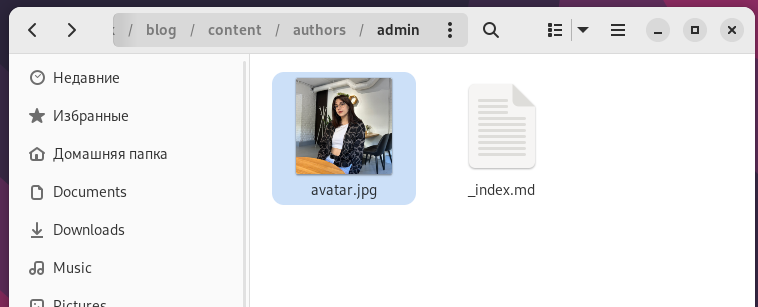{#fig:001 width=70%}

## Выполнение лабораторной работы

В файлу index.md в той же папке изменяю поля. Начинаю с библиографии (рис. 2).

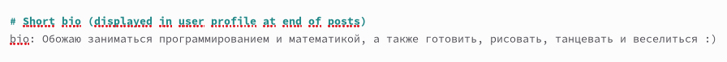{#fig:002 width=70%}

## Выполнение лабораторной работы

Изменила интересы на свои (рис.3).

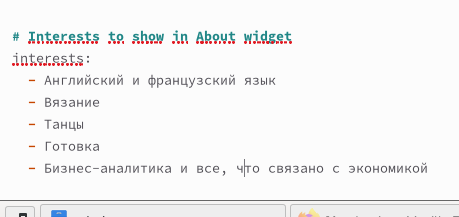{#fig:003 width=70%}

## Выполнение лабораторной работы

Добавила свое образование (рис.4).

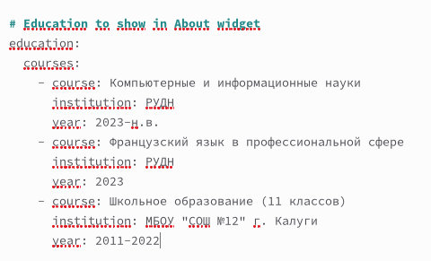{#fig:004 width=70%}

## Выполнение лабораторной работы

Обновила личные данные, чтобы они были про меня (рис.5).

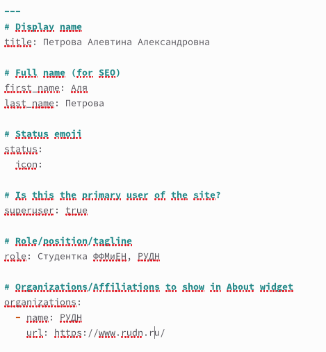{#fig:005 width=50%}

## Выполнение лабораторной работы

Проверила, что на локальном сайте все есть. Локальный сайт запускается с помощью hugo server (рис.6).

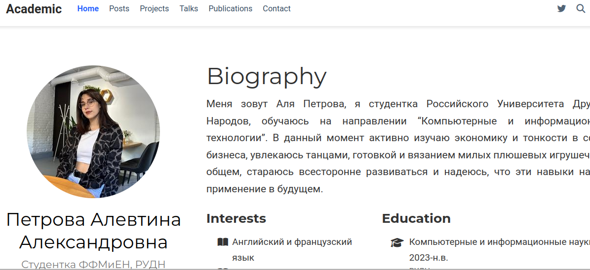{#fig:006 width=70%}

## Выполнение лабораторной работы

Заполнила файл index.md в post1, это пост про прошедшую неделю (рис.7).

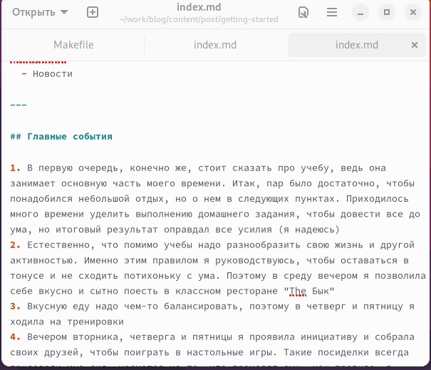{#fig:007 width=50%}

## Выполнение лабораторной работы

Заполнила файл index.md в post2, это пост про управление версиями Git (рис.8).

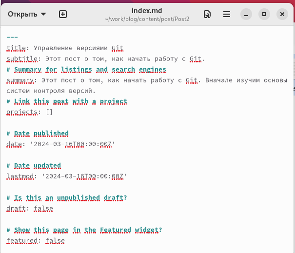{#fig:008 width=40%}

## Выполнение лабораторной работы

Проверяю посты на локальном сервере (рис.9).

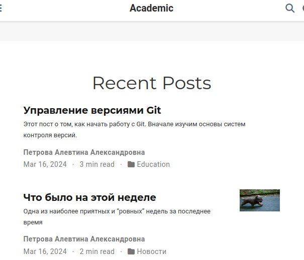{#fig:009 width=40%}

## Выполнение лабораторной работы

Закрываю локальный сервер. Генерирую сайт с изменениями (рис.10).

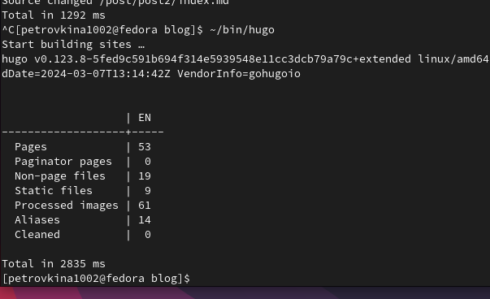{#fig:010 width=70%}

## Выполнение лабораторной работы

Сохраняю изменения на гите  (рис. 11).

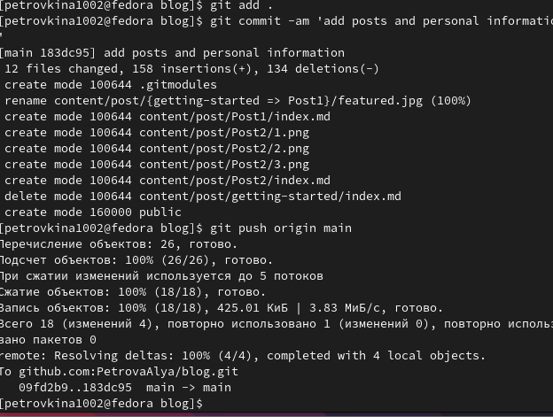{#fig:011 width=50%}

## Выполнение лабораторной работы

Проверила, как выглядит сайт в браузере (рис. 12).

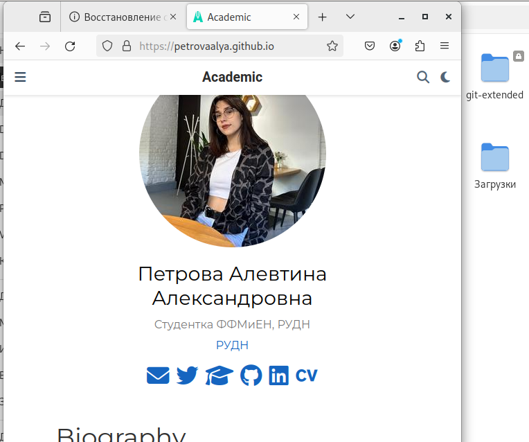{#fig:012 width=45%}

## Выводы

В процессе выполнения второго этапа индивидуального проекта я научилась редактировать данные о себе, а также писать посты и добавлять их на сайт.

