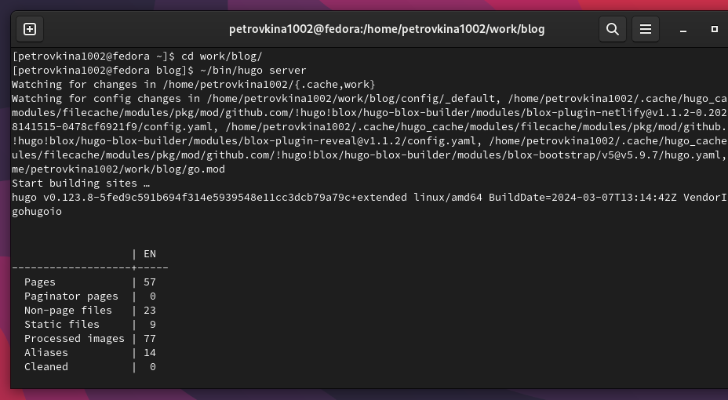
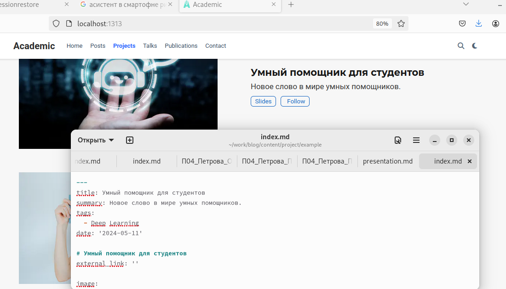
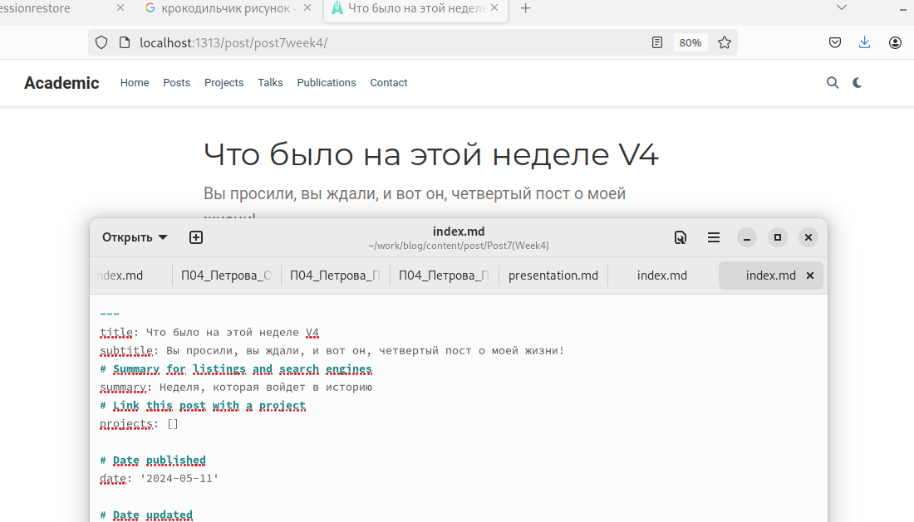
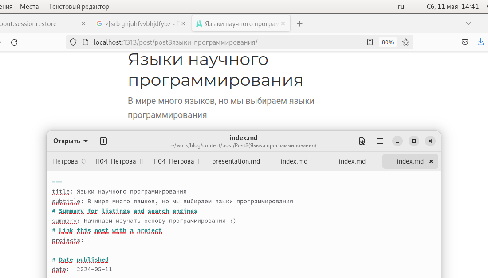

---
## Front matter
lang: ru-RU
title: Презентация 5 этапа индивидуального проекта
subtitle: Операционные сисемы
author:
  - Петрова А. А.
institute:
  - Российский университет дружбы народов, Москва, Россия
  
date: 11 мая 2024

## i18n babel
babel-lang: russian
babel-otherlangs: english

## Formatting pdf
toc: false
toc-title: Содержание
slide_level: 2
aspectratio: 169
section-titles: true
theme: metropolis
header-includes:
 - \metroset{progressbar=frametitle,sectionpage=progressbar,numbering=fraction}
 - '\makeatletter'
 - '\beamer@ignorenonframefalse'
 - '\makeatother'
---

## Цель работы

Добавить к сайту записи для персональных проектов и сделать два поста.

## Задание

1. Добавить с сайту все остальные элементы.
2. Сделать записи для персональных проектов.
3. Сделать пост по прошедшей неделе.
4. Добавить пост на тему Языки научного программирования

## Выполнение лабораторной работы

Сначала запускаю локальный сервер через терминал (рис. 1)

{#fig:001 width=70%}

## Выполнение лабораторной работы

Создаю запись о персональном проекте (рис. 2)

{#fig:002 width=70%}

## Выполнение лабораторной работы

Пишу пост о прошедшей неделе (рис. 3)

{#fig:003 width=70%}

## Выполнение лабораторной работы

Пишу пост на тему "Языки научного программирования" (рис.4)

{#fig:004 width=70%}

## Выполнение лабораторной работы

После того, как выгрузила все изменения на гитхаб, проверяю, что всё сохранилось и находится на общем сервере(рис.5), (рис.6)

{#fig:005 width=70%}

## Выполнение лабораторной работы

{#fig:006 width=70%}

## Выводы

В результате выполнения пятого этапа индивидуального проекта были Добавлены к сайту записи для персональных проектов и сделаны два поста

